# 2023秋《操作系统》课程实验报告

> 实验一
>
> 21301114 俞贤皓
>
> 环境：Arch Linux 6.5.3-arch1-1

## 一、实验步骤

### 1. 创建rust项目

* 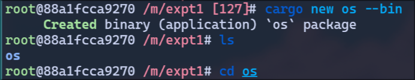
* 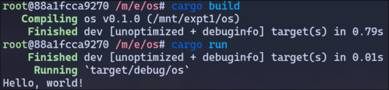

### 2. 移除标准库依赖

#### 2.1 移除标准库依赖

* 修改 `.cargo/config` 和 `src/main.rs`

  * 但是 `cargo build` 发生错误，提示找不到 `core` 这个 `crate`
  * 故根据文档修正
  * 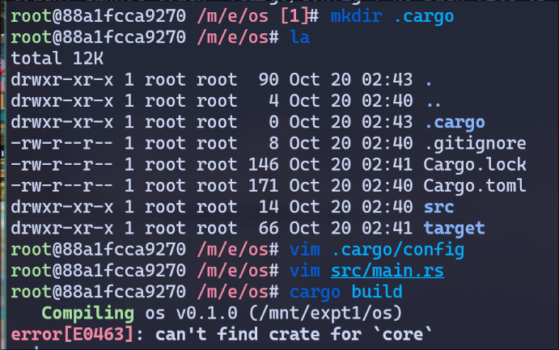
  * 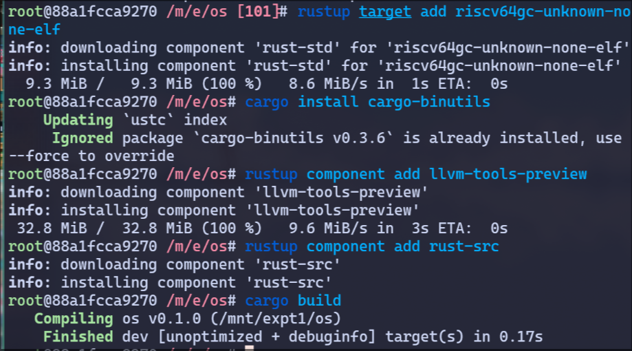

* 重新安装后，编译成功

  * 这四条命令之前都执行过，所以在想是不是因为修改了target后，所以才需要重新下载依赖

#### 2.2 提交git

* 提交git

  * 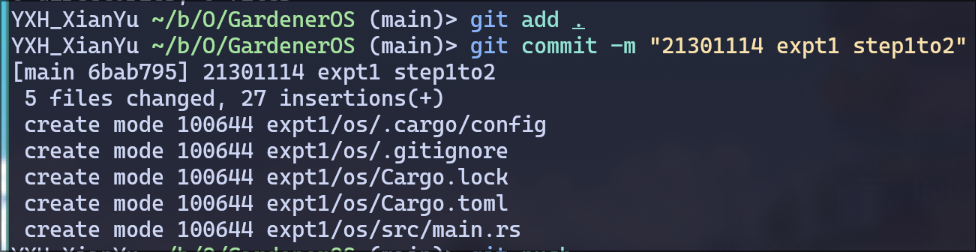
  * 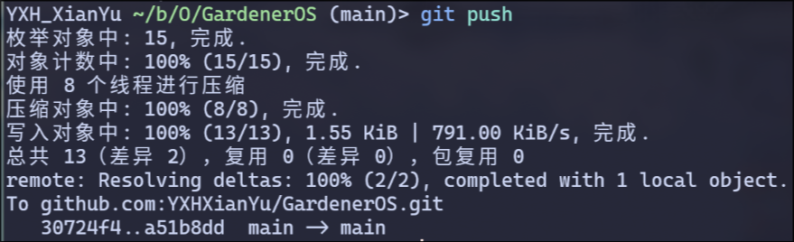

#### 2.3 分析独立的可执行程序

* 注：**我在分析时主要参考chatgpt**，chatgpt可以快速告诉你非常多你不了解的知识，是高效的学习助手！

* `file /path/to/os`

  * 命令作用：`file` 命令可以用于确定文件类型，并输出相关信息

  * 输出内容

    ```
    target/riscv64gc-unknown-none-elf/debug/os: ELF 64-bit LSB executable, UCB RISC-V, RVC, double-float ABI, version 1 (SYSV), statically linked, with debug_info, not stripped
    ```

  * 分析

    * `ELF`：ELF是一种常见的二进制文件格式
    * `64-bit`：是64位程序，可以在64位机器上运行
    * `LSB`：Least Significant Bit，小端序，低字节在地址编号小的内存，高字节在地址编号大的内存
    * etc

* `rust-readobj -h /path/to/os `

  * 命令作用：这个命令是 `llvm` 工具集中的一个命令 `readobj` 的 `rust` 版本。可以用于分析可执行程序等二进制文件的信息。

    * chatgpt对于 `-h` 参数给了一个错误的回答，经过尝试，我发现 `-h` 可以输出关于 `ElfHeader` 的详细信息

  * 输出内容

    ```
    File: target/riscv64gc-unknown-none-elf/debug/os
    Format: elf64-littleriscv
    Arch: riscv64
    AddressSize: 64bit
    LoadName: <Not found>
    ElfHeader {
      Ident {
        Magic: (7F 45 4C 46)
        Class: 64-bit (0x2)
        DataEncoding: LittleEndian (0x1)
        FileVersion: 1
        OS/ABI: SystemV (0x0)
        ABIVersion: 0
        Unused: (00 00 00 00 00 00 00)
      }
      Type: Executable (0x2)
      Machine: EM_RISCV (0xF3)
      Version: 1
      Entry: 0x0
      ProgramHeaderOffset: 0x40
      SectionHeaderOffset: 0x1B00
      Flags [ (0x5)
        EF_RISCV_FLOAT_ABI_DOUBLE (0x4)
        EF_RISCV_RVC (0x1)
      ]
      HeaderSize: 64
      ProgramHeaderEntrySize: 56
      ProgramHeaderCount: 3
      SectionHeaderEntrySize: 64
      SectionHeaderCount: 14
      StringTableSectionIndex: 12
    }
    ```

  * 为了分析，并且 **证明** 这个可执行程序 **确实没有入口**，所以要弄个 **有入口** 的可执行程序，并且对比他们的信息。所以我另外写了一份代码，名叫 `os2`，并根据文档添加了 `_start` 函数，进行对比，结果如下。

    * 只有五行不同，如下：

      ```
        Entry: 0x11120
        SectionHeaderOffset: 0x1CF0
        ProgramHeaderCount: 4
        SectionHeaderCount: 16
        StringTableSectionIndex: 14
      ```

    * 最关键的信息为 `Entry`

    * 可以看到，无入口的可执行程序 `Entry` 为 `0x0` 这一个非常特殊的全0值，有入口的可执行程序 `Entry` 为 `0x11120`。所以我认为，`Entry` 为 `0` 就表示 **该可执行程序不存在入口**。

  * 截图

    * 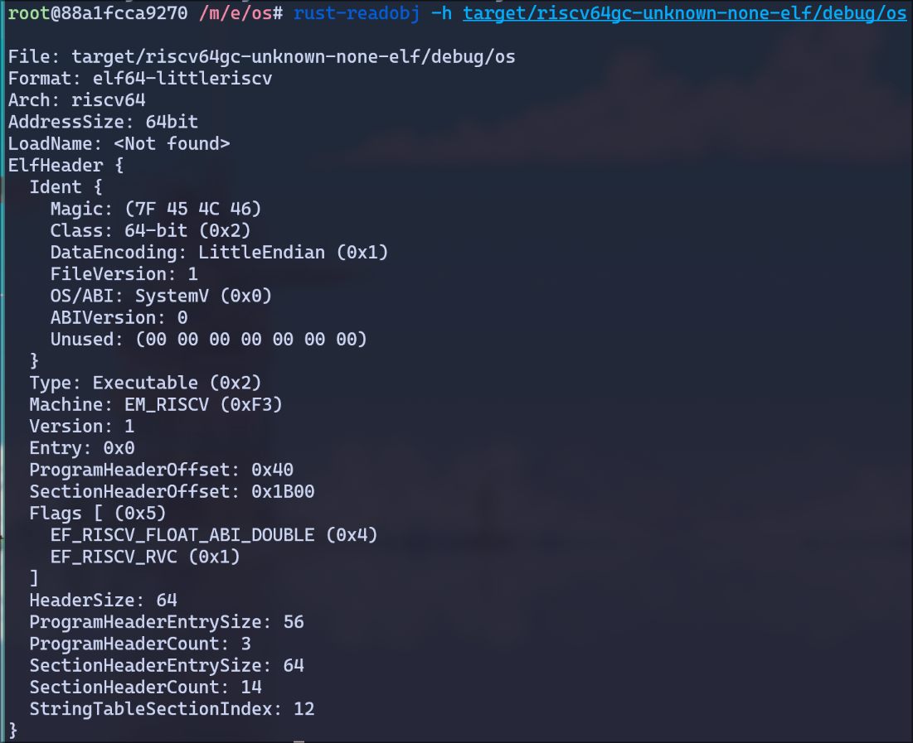

* `rust-objdump -S /path/to/os`

  * 命令作用：`gcc`的`objdump`为反汇编工具，所以`rust-objdump`命令大概率也是个反汇编工具。但和chatgpt经过交流之后，我发现 `-S` 这个参数用于显示文件头，`-d` 参数才能用于反汇编。
    * chatgpt又错了
      * 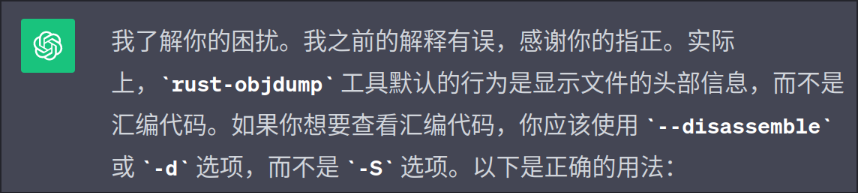
  * 对比无入口的可执行程序和有入口的可执行程序，发现文件头明显不同，这第二次证明了无入口可执行程序确实没有入口
    * 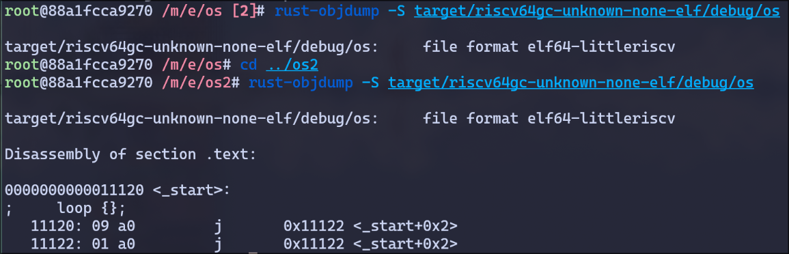

### 3. 用户态可执行的环境

* 回到无入口的程序，并根据文档添加了入口
  * 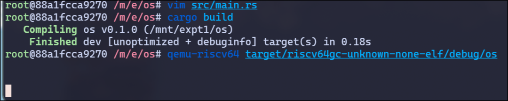
  * 确实出现了死循环，没有问题
* 添加程序退出机制
  * 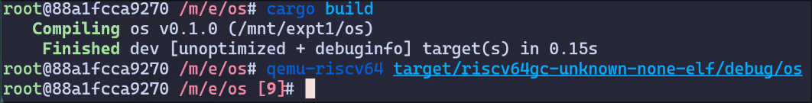
  * 确实退出了，并且返回了 `9`，没有问题
* 实现输出支持
  * 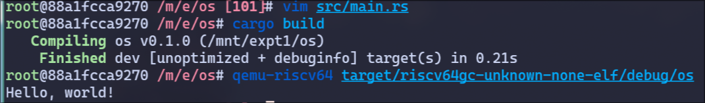
* 成功了！好耶！

## 二、思考问题

### 2.1

* 问题
  * 为什么称最后实现的程序为独立的可执行程序，它和标准的程序有什么区别？

* 回答
  * 独立，指的是这个程序不依赖任何rust标准库和操作系统。换句话说，这个可执行程序实现了一个最小的能够输出内容的程序，只使用 `main.rs` 里的代码，不依赖任何其他代码，对操作系统也没有任何需求（甚至连系统调用都是自己实现的）
  * 独立的可执行程序 和 标准的程序 的区别是：标准的程序会依赖库函数、操作系统；独立的可执行程序，不依赖任何库和操作系统，只使用程序自身的代码。

### 2.2

* 问题
  * 实现和编译独立可执行程序的目的是什么？
* 回答
  * 目的是确保程序可以在裸机环境中运行。
  * 裸机环境没有操作系统，所以就没有系统调用和各种库，所以运行在裸机环境上的程序，也就不能调用系统调用api。因此，我们需要一个独立可执行程序，在没有系统调用的前提下，完成各种操作。

## 三、Git提交截图

* 

## 四、其他说明

* 无