# 操作系统 实验2

> 21301114 俞贤皓
>
> 环境：Arch Linux 6.5.3-arch1-1

## 1. 实验步骤

### 1.1 编译生成内核镜像

* 编译并生成binary文件
  * 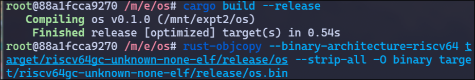
* 载入 `rustsbi.bin` 文件
  * 
* 第一次运行此文件
  * 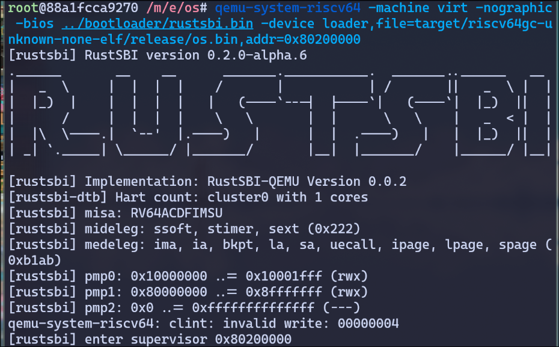
* `docker` 容器卡死
  * 执行 `sudo docker restart os` 命令
* 分析可执行程序，发现入口确实不为 `0x80200000`
  * 

### 1.2 指定内存布局

* 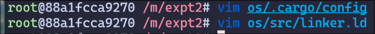

### 1.3 配置栈空间布局

* 

### 1.4 清空bss段

* 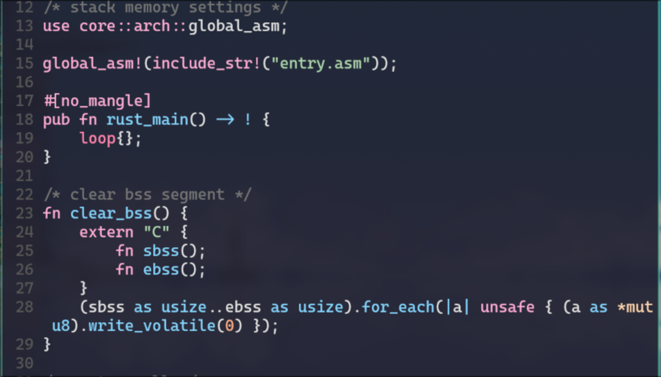

### 1.5 实现裸机打印输出信息

* 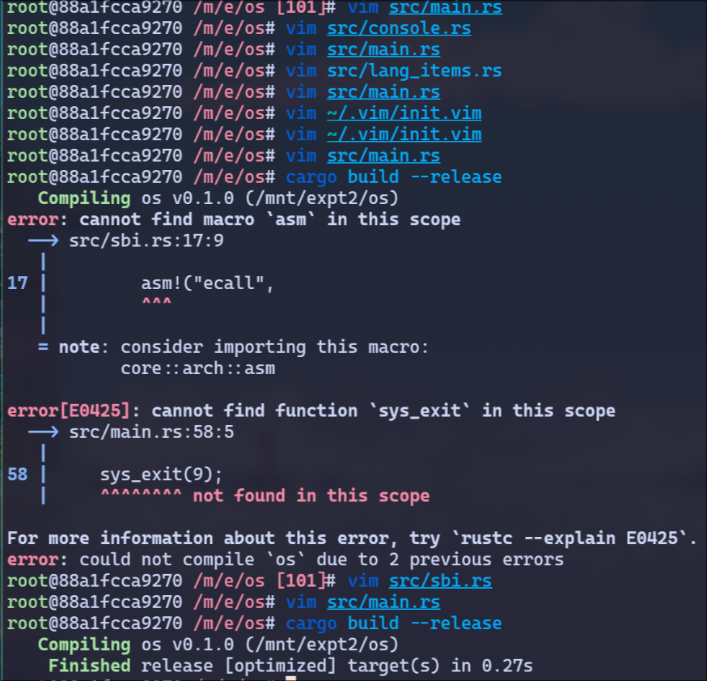

### 1.6 重新编译并运行

* 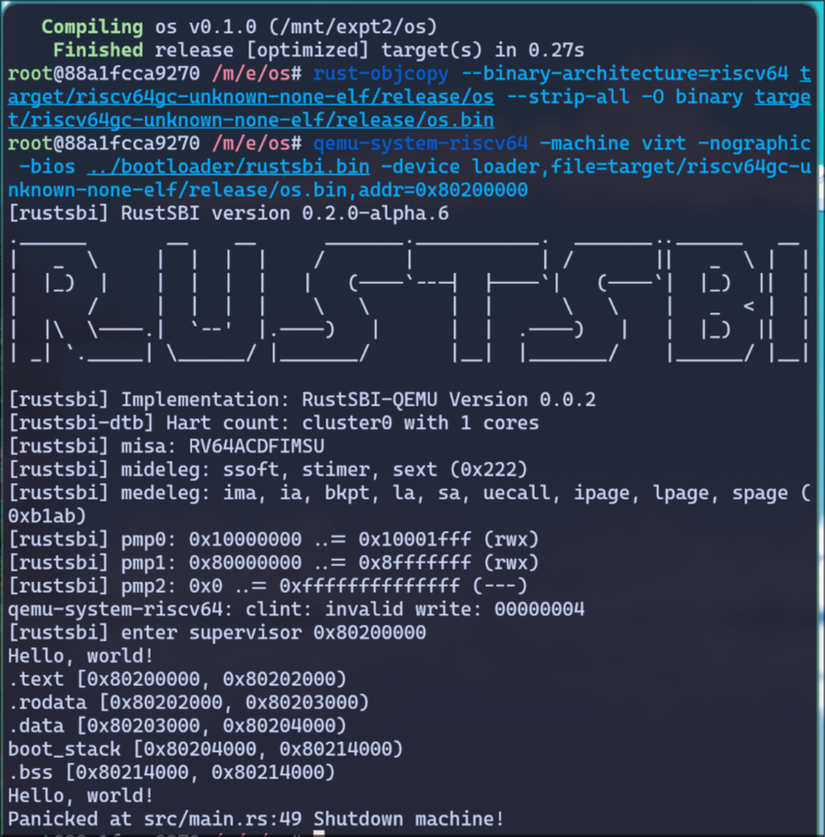

### 1.7 Makefile

* 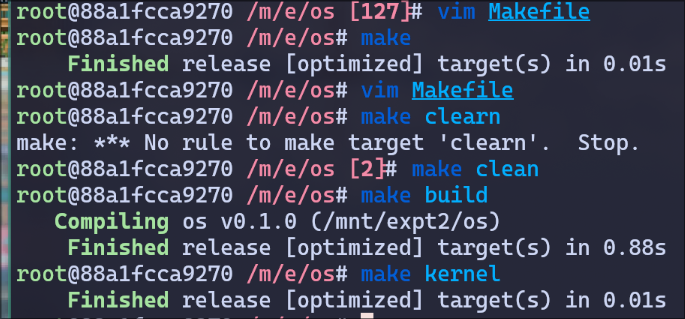
* 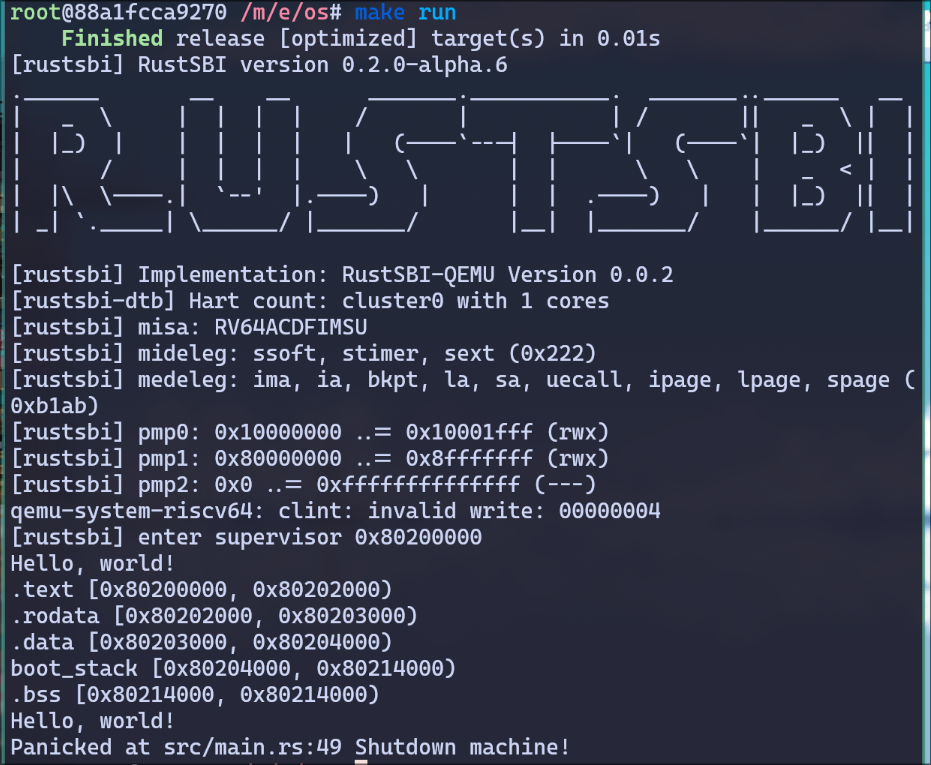

## 2. 思考问题

### 2.1

* 问题：分析 `linker.ld` 和 `entry.asm` 所完成的功能
* 回答
  * `linker.ld`
    * 如文档所述，`linker.ld` 在这次实验中的功能是 **指定内存布局**
    * 第一行 `OUTPUT_ARCH(riscv)` 指定了程序的架构
    * 第二行 `ENTRY(_start)` 指定了程序的入口
    * 第三行指定了程序的入口地址为 `0x80200000`
    * 之后部分定义了程序各个段的布局（按顺序，分别定义了 `text代码段`、`rodata只读数据段`、`data数据段`、`bss未初始化的数据段`），其中 `ALIGN(4K)` 表示新的段距离上一个段的开头偏移了4K字节
    * 通过 `rust-readobj` 分析，可以发现程序入口确实变为了 `0x80200000`
      * 
  * `entry.asm`
    * 如文档所述，`entry.asm` 在这次实验中的功能是 **配置栈空间布局**
    * `.section .text.entry` 定义了一个代码段，表示程序入口
    * `.globl _start` 定义了一个全局的标记 `_start` 和 `linker.ld` 的 `ENTRY(_start)` 相对应，表示程序入口。而 `call rust_main` 表示在 `_start` 这个函数中调用 `rust_main`，这应该和 `main.rs` 里的 `rust_main` 相对应。
    * `.section .bss.stack` 定义了一个bss段，表示栈空间
    * `.globl boot_stack` 和接下来的代码，定义了一个长度为 `4096 * 16` 字节的栈空间

### 2.2

* 问题：分析 `sbi` 模块和 `lang_items` 模块所完成的功能
* 回答
  * `sbi` 模块
    * 本模块和实验1中的 `system call` 部分代码功能类似，都通过 **内联汇编** 语法，与硬件进行交互，实现了 **系统调用**。`sbi_call` 和 `syscall` 函数，大体类似，只有参数和返回值的区别。
    * `console_putchar` 等3个函数，对 `sbi_call` 函数进行封装，实现了3种不同的系统调用，并且以 **pub** 的方式抛出接口，供外部调用。（`sbi_call` 为私有函数，其他模块无法调用）
    * `console` 模块对 `console_putchar` 系统调用进行封装，实现了 rust 风格的输出函数与输出宏

  * `lang_items` 模块
    * 本模块名为 `lang_items`，所以本模块应该实现一些有关高级语言的特性。但在本次实验中，`lang_items` 模块只实现了 **异常** 特性，所以预测在之后的实验中，本模块的功能会被拓展。
    * `lang_items` 实现了 **异常处理函数panic**
    * 在实验1的 `main.rs` 中也有类似的实现
    * 不同的是，本模块的异常处理函数实现了异常信息输出，并且新增了 `shutdown()` 系统调用。当发生异常时，操作系统会打印出异常信息，并且关机


### 2.3

* 问题：可选：如果将 `rustsbi.bin` 换成最新版本的会造成代码无法运行，分析原因并给出解决方法。

* 操作流程
  * 新建 `os-ex` 与 `bootloader-ex` 文件夹，并将原代码与最新版本的 `rustsbi-qemu.bin` 置于对应目录下
  
    * 我使用了2023-10-27最新pre-released `rustsbi-qemu`
    * 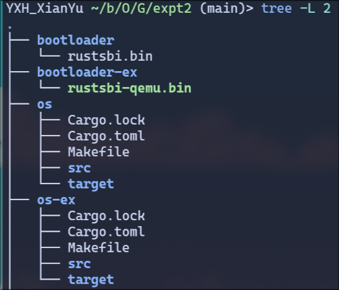
  
  * 进入 `os-ex`，将引导程序修改为 `bootloader-ex` 下的对应程序
  
    * 修改 `Makefile:8~9` 为
  
      ```makefile
      SBI ?= rustsbi-qemu
      BOOTLOADER := ../bootloader-ex/$(SBI).bin
      ```
  
  * 测试
  
    * `make`、`make build` 均可正常执行
    * `make run` 出现了不正常的结果，在输出 `Hello, world!` 和 `Panicked ... Shutdown machine!` 之后，程序又输出了大量 `src/sbi.rs:40 It should shutdown!` 异常和乱码（应该是无限递归调用panic函数，导致栈空间溢出），并卡死
      * 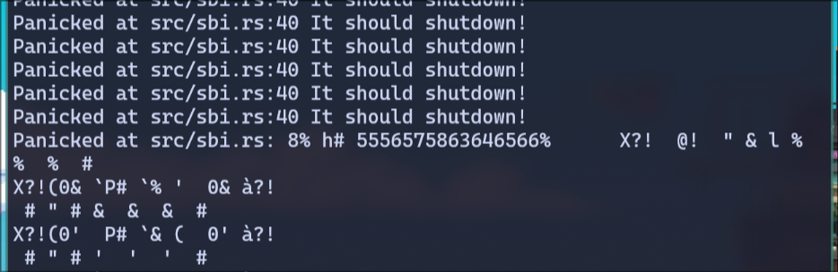
  
  * 解决
  
    * 首先分析异常发生的代码，即 `src/sbi.rs:40`，发现操作系统并没有正常关闭。所以考虑sbi调用的接口是否发生了变化。但查询后，发现sbi调用的接口和常量均和原来相同。[常量](https://elixir.bootlin.com/linux/latest/C/ident/SBI_EXT_0_1_SHUTDOWN) 与 [接口文档](https://docs.rs/rustsbi/0.2.0-alpha.10/rustsbi/index.html)（下文发现这个结论是错误的，sbi调用的接口更新了。这里错误的原因是文档仍然过时）
    * 使用搜索引擎，搜到了 [rCore-Tutorial仓库的Issue](https://github.com/rcore-os/rCore-Tutorial/issues/127)，按照文中方法进行修改。但现在，程序执行到 `sbi_call` 时，就直接卡死了，问题还是没有解决
    * 参考 [rCore-Tutorial-v3](https://github.com/rcore-os/rCore-Tutorial-v3/tree/ch1) 的lab1源代码，引入了 `sbi-rt` 库，并修改了 `src/sbi.rs`。问题成功解决！
      * 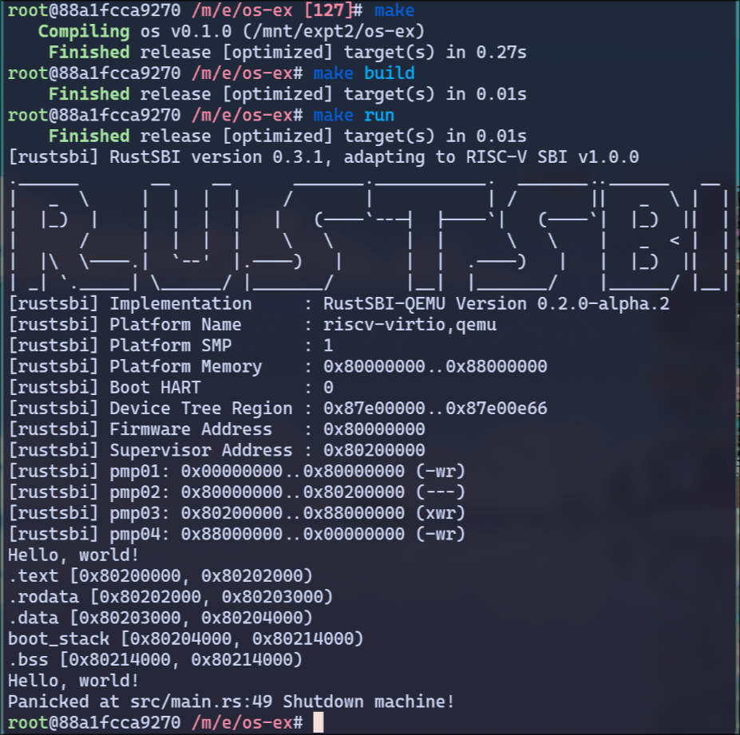
  
  * 思考
  
    * 虽然解决了问题，但只知道死循环是接口更新导致的，并没有了解到更本质原因。所以继续分析，查阅 `sbi-rt` 文档
    * [sbi-rt](https://github.com/rustsbi/sbi-rt) 是 `sbi` 的运行时库，相当于帮我们实现了一套 `sbi` 接口。对比了 `sbi-rt` 的 `sbi_call` 源码，发现和我们的实现并没有区别，区别只在调用的常数上，于是跟踪到 `sbi-spec` 仓库
    * [sbi-spec](https://github.com/rustsbi/sbi-spec) 实现了 `sbi标准` 定义的常量和结构。在 `src/srst.rs` 中，我们发现了问题的答案！sbi标准确实更新了，`shutdown` 不应该直接将 `extension id` 设置为0，而是应该设置 `extension id` 为 `0x53525354`，并把 `function id` 设置为 `0`。这和最开始我的猜想相同，只不过我找到了错误的文档。
  
  * 再次解决
  
    * 将 `sbi-rt` 依赖删去，并且修改 `src/sbi.rs`。执行 `make run`，成功了！
      * 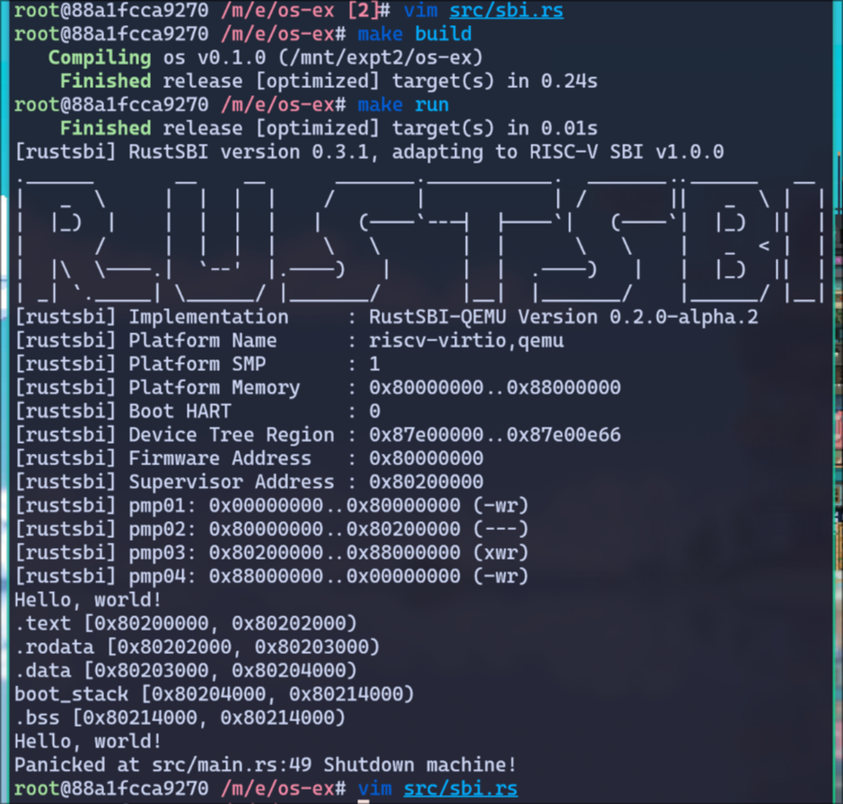
    
  * 接口标准更新的证明
  
    * 查阅 [riscv-sbi文档](https://github.com/riscv-non-isa/riscv-sbi-doc/releases/download/v2.0-rc1/riscv-sbi.pdf)，章节5提到：
  
      >The legacy SBI extensions is deprecated in favor of the other extensions listed below. The legacy console SBI functions (sbi_console_getchar() and sbi_console_putchar()) are expected to be deprecated; they have no replacement.
  
    * 在章节5.10中可以看到 legacy function table，上面提到：
  
      * 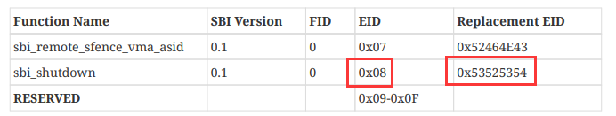
  
    * 这足以说明，本接口确实被废弃，并且应该使用新的接口
  
    * 比较前后两种接口，新的接口功能性更强，可以通过 **FID** 来指定关机、冷重启、热重启等。所以我猜想，旧接口因为拓展性不足，而被废弃。
  
* 原因
  * `sbi标准` 更新，需要使用新的API才能正常关机。
  
* 解决方法
  * 将 `src/sbi.rs` 修改为：
  
    ```rust
    #![allow(unused)]
    
    // pub fn console_putchar(c: usize) {
    //     #[allow(deprecated)]
    //     sbi_rt::legacy::console_putchar(c);
    // }
    // 
    // pub fn console_getchar() -> usize {
    //     #[allow(deprecated)]
    //     sbi_rt::legacy::console_getchar()
    // }
    // 
    // pub fn shutdown() -> ! {
    //     use sbi_rt::{system_reset, NoReason, Shutdown};
    //     system_reset(Shutdown, NoReason);
    //     panic!("It should shutdown!");
    // }
    
    use core::arch::asm;
    
    const SBI_SET_TIMER: usize = 0;
    const SBI_CONSOLE_PUTCHAR: usize = 1;
    const SBI_CONSOLE_GETCHAR: usize = 2;
    const SBI_CLEAR_IPI: usize = 3;
    const SBI_SEND_IPI: usize = 4;
    const SBI_REMOTE_FENCE_I: usize = 5;
    const SBI_REMOTE_SFENCE_VMA: usize = 6;
    const SBI_REMOTE_SFENCE_VMA_ASID: usize = 7;
    const SBI_SHUTDOWN: usize = 8;
    
    // const SBI_STOP_EXTENSION: usize = 0x48534D;
    // const SBI_STOP_FUNCTION: usize = 1;
    const SBI_EID_SRST: usize = 0x53525354;
    const SBI_SYSTEM_RESET: usize = 0;
    
    #[inline(always)]
    fn sbi_call(eid: usize, fid: usize, arg0: usize, arg1: usize, arg2: usize) -> usize {
        let mut ret;
        unsafe {
            asm!("ecall",
                 in("x10") arg0,
                 in("x11") arg1,
                 in("x12") arg2,
                 in("x16") fid,
                 in("x17") eid,
                 lateout("x10") ret
            );
        }
        ret
    }
    
    pub fn console_putchar(c: usize) {
        sbi_call(SBI_CONSOLE_PUTCHAR, 0, c, 0, 0);
    }
    
    pub fn console_getchar() -> usize {
        sbi_call(SBI_CONSOLE_GETCHAR, 0, 0, 0, 0)
    }
    
    pub fn shutdown_deprecated() -> ! {
        sbi_call(SBI_SHUTDOWN, 0, 0, 0, 0);
        panic!("It should shutdown! (deprecated shutdown function)");
    }
    
    pub fn shutdown() -> ! {
        sbi_call(SBI_EID_SRST, SBI_SYSTEM_RESET, 0, 0, 0);
        panic!("It should shutdown!");
    }
    ```

## 3. Git提交截图

* [仓库链接](github.com/YXHXianYu/GardenerOS)
* 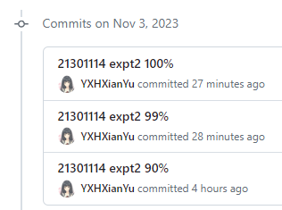

## 4. 其他说明

* 实验很有意思
