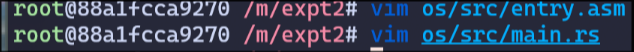

# 操作系统 实验2

> 21301114 俞贤皓
>
> 环境：Arch Linux 6.5.3-arch1-1

## 1. 实验步骤

### 1.1 编译生成内核镜像

* 编译并生成binary文件
  * 
* 载入 `rustsbi.bin` 文件
  * 
* 第一次运行此文件
  * 
* `docker` 容器卡死
  * 执行 `sudo docker restart os` 命令
* 分析可执行程序，发现入口确实不为 `0x80200000`
  * 

### 1.2 指定内存布局

* 

### 1.3 配置栈空间布局

* 

### 1.4 清空bss段

* 

### 1.5 实现裸机打印输出信息

* 

### 1.6 重新编译并运行

* 

### 1.7 Makefile

* 
* 

## 2. 思考问题

### 2.1

* 问题：分析 `linker.ld` 和 `entry.asm` 所完成的功能
* 回答
  * `linker.ld`
    * 如文档所述，`linker.ld` 在这次实验中的功能是 **指定内存布局**
    * 第一行 `OUTPUT_ARCH(riscv)` 指定了程序的架构
    * 第二行 `ENTRY(_start)` 指定了程序的入口
    * 第三行指定了程序的入口地址为 `0x80200000`
    * 之后部分定义了程序各个段的布局（按顺序，分别定义了 `text代码段`、`rodata只读数据段`、`data数据段`、`bss未初始化的数据段`），其中 `ALIGN(4K)` 表示新的段距离上一个段的开头偏移了4K字节
    * 通过 `rust-readobj` 分析，可以发现程序入口确实变为了 `0x80200000`
      * 
  * `entry.asm`
    * 如文档所述，`entry.asm` 在这次实验中的功能是 **配置栈空间布局**
    * `.section .text.entry` 定义了一个代码段，表示程序入口
    * `.globl _start` 定义了一个全局的标记 `_start` 和 `linker.ld` 的 `ENTRY(_start)` 相对应，表示程序入口。而 `call rust_main` 表示在 `_start` 这个函数中调用 `rust_main`，这应该和 `main.rs` 里的 `rust_main` 相对应。
    * `.section .bss.stack` 定义了一个bss段，表示栈空间
    * `.globl boot_stack` 和接下来的代码，定义了一个长度为 `4096 * 16` 字节的栈空间

### 2.2

* 问题：

## 3. Git提交截图

## 4. 其他说明

