# 操作系统 实验3

> 21301114 俞贤皓
>
> 环境（实验0~2）：Arch Linux 6.5.3-arch1-1
>
> 环境（实验3）：Ubuntu 22.04.3 LTS (WSL)

## 1. 实验步骤

### 1.0 备注

* 我在上节课中，使用了0.2.0-alpha.2版本的rustsbi-qemu完成了实验，所以之后的实验我也均用最新版的rustsbi-qemu完成。
  * 我会把我遇到与新版rustsbi-qemu有关的问题 **加粗**
* 因为单双周记错了，所以实验课没带笔记本。前端时间正好给宿舍台式机配置了frp内网穿透，实现了ssh访问windows下的wsl。故今天尝试通过安卓的termux使用ssh，连接宿舍台式机的wsl，完成操作系统实验。
  * 所以本次实验的终端界面和前几次实验的终端界面不同
* 首先，要在wsl中配置实验环境
  * 安装Docker、载入镜像、生成容器、执行实验1开头的4句补充命令、`make && make run`。
  * 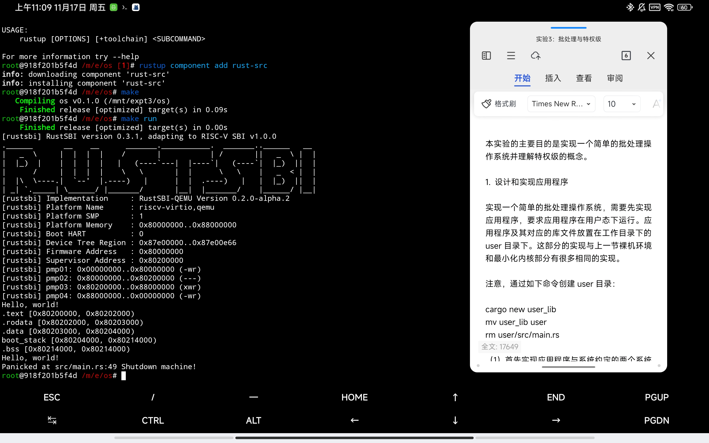
  * 环境配置完毕

### 1.1 设计和实现应用程序

* 创建应用程序
  * 这里先 `cargo new user_lib` 再 `mv user_lib user` ，是为了使 `user/Cargo.toml` 中的项目名称是 `user_lib`
  * 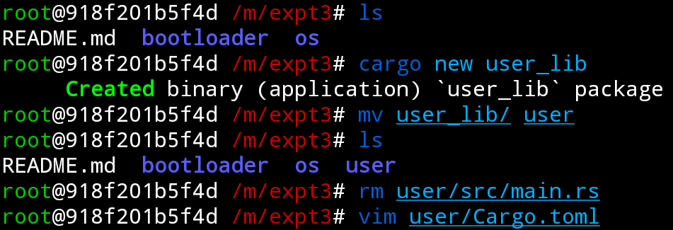

* 根据手册编写代码
  * 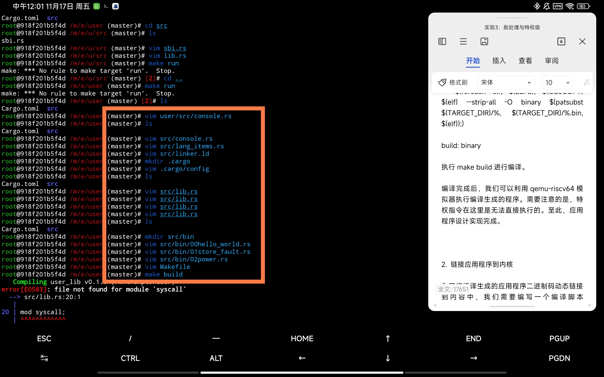

* `make build` 并使用 `qemu-riscv64` 进行测试
  * 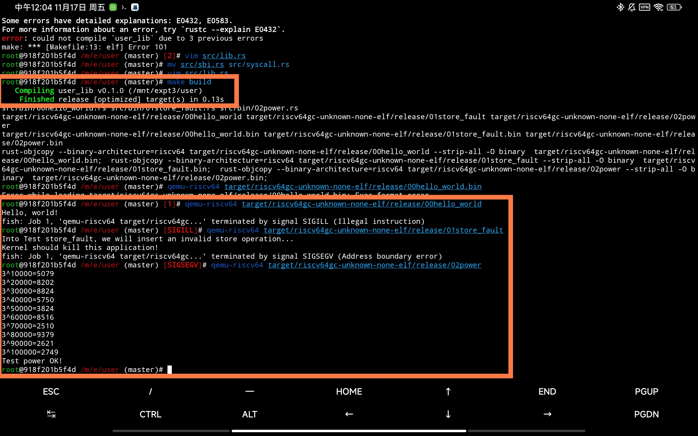


### 1.2~1.6 链接、加载、执行应用程序、实现用户/内核栈、trap管理

* 根据手册编写代码
  * 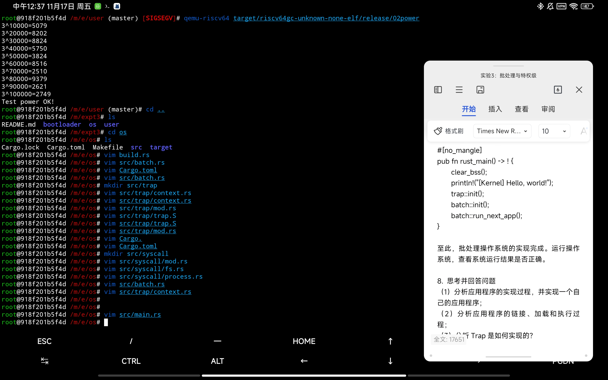

### 1.7 编译并运行

* 编译
  * 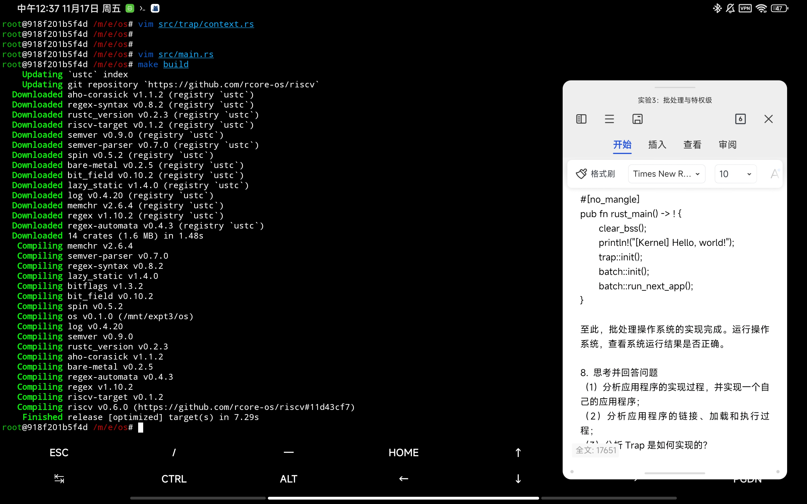
* 运行
  * 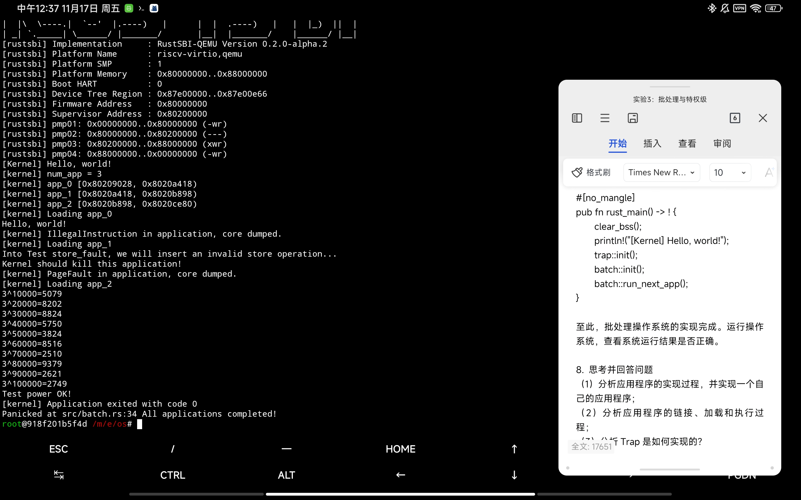

## 2. 思考问题

### 2.1 分析应用程序的实现过程，并实现一个自己的应用程序

#### 2.1.1 分析实现过程

* 首先，创建一个应用程序的执行环境

  * `syscall.rs` 实现了该应用程序能够执行的所有系统调用
  * `console.rs` 实现了格式化输出
  * `lang_items.rs` 实现了语义支持（目前只有异常处理）
  * `linker.ld` 实现了内存布局
  * `lib.rs` 实现了入口程序：清空bss段，并让_start()跳转到main()

* 编写应用程序代码

  * 在 `bin/` 下编写一个只基于上述执行环境的代码即可

  * `00hello_world.rs` 中 `asm!("sret")` 的作用

    * `sret` 的作用：`sret` 是RISCV架构中的一个指令，用于在异常处理中，从内核态返回到用户态。
    * 这个语句的作用：执行一条非法指令，检测内核是否正确实现。
    * 执行 `asm!("sret")`，出现：

      ```
      [kernel] IllegalInstruction in application, core dumped.
      ```

    * 注释 `asm!("sret")`，出现：

      ```
      [kernel] Application exited with code 0
      ```
    
  * `01store_fault.rs`

    * 这段代码试图往地址0x0的内存处写入数据，被内核中断。
    * 这个代码和 `00hello_world` 中的 `asm!("sret")` 的作用类似，用于测试内核是否正确实现了内存保护之类的功能

  * `02power.rs`

    * 这段代码用朴素的 $O(n)$ 算法计算了 $3^n \ \% \ 10007, n \leq 1e5$，并输出了指定的 $10$ 个值

* 编译与执行

  * 编写 `Makefile` 并执行
  * 可以使用 `qemu-riscv64` 进行测试，确保应用程序执行正确


#### 2.1.2 实现一个自己的应用程序

* `03quick_power.rs`

  * 作为算法竞赛选手，所以我想先实现一个 $O(logn)$ 的快速幂算法

  * 计算内容同 `02power.rs`，但 $n$ 扩大到了 $1e18$

  * 代码如下

    ```rust
    #![no_std]
    #![no_main]
    #[macro_use]
    extern crate user_lib;
    
    fn quick_power(base: u64, expo: u64, modu: u64) -> u64 {
        let mut a: u64 = base;
        let mut n: u64 = expo;
        let mut ans: u64 = 1;
        while n >= 1 {
            if (n & 1 != 0) { ans = ans * a % modu; }
            a = a * a % modu;
            n >>= 1;
        }
        ans
    }
    
    #[no_mangle]
    fn main() -> i32 {
        const P: u32 = 3;
        const STEP: usize = 1_000_000_000_000_000_000; // 1e18
        const MOD: u32 = 10007;
        println!(
            "quick_power: {} ^ {} % {} = {}",
            P, STEP, MOD,
            quick_power(P as u64, STEP as u64, MOD as u64)
        );
        0
    }
    ```

  * 编译执行

    * 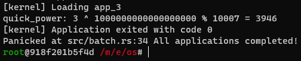
    * 竟然什么都不用修改就直接在内核中执行成功了！？

* `04interactive_power.rs`

  * 添加了标准输入功能
  * 修改了很多代码之后，编译执行，成功了
    * 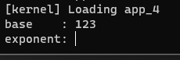
    * 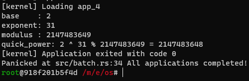
    * 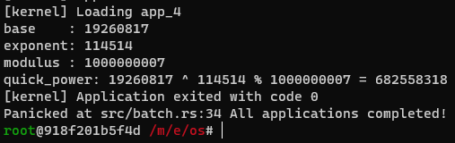
  
* `06dinosaur_game`

  * **我在OS上实现了一个小游戏！**
  * 主要仿造Chrome浏览器的经典小恐龙游戏做的（Dinosaur Game）
  * 按 `Enter` 可以前进，按 `Space` 可以跳跃！
  * 尽可能躲过更多的障碍物，走得更远吧！！！
  * 游戏视频DEMO：https://www.bilibili.com/video/BV1Hu4y1L72Q
  * 游戏画面
    * 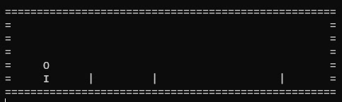
    * 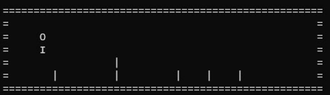
    * 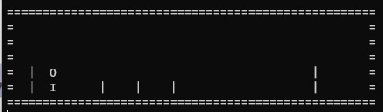
  * **太酷了！！！！！！！！！！！！！！！！！！！！！爽到！**
  * 用了一些技巧
    * 没有std库，没法实现sleep，于是写了个递归计算斐波那契数列的函数，因为递归计算斐波那契数列的复杂度是指数，所以可以方便的让整个OS阻塞。
    * 没有std库，没法清空屏幕，所以就输出了30个空行实现。
    * 游戏实现了双缓冲模式，使得游戏画面显示不卡顿。
  * 代码蛮短的，除了用到了上个应用程序的输入，其他代码都只在这一个文件中。


### 2.2 分析应用程序的链接、加载和执行过程

#### 2.2.1 链接

* `os/build.rs`

* 在rust中，`build.rs` 是一个用于构建代码的文件。这里，我们的代码直接使用了rust标准库内的函数和宏。这是因为，`build.rs` 只用于预处理，不涉及编译后的操作系统内核，所以我们可以在 `build.rs` 中任意使用库函数。

* 该脚本往标准输出流中输出了以下内容

  * 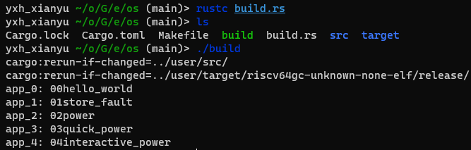

  * 这里前两行说明，如果 `/user/src` 或 `/user/target/riscv.../release` 目录下有文件变更，那么就重新build

    * **我发现了文档代码中的一个bug**

      * 这两行的作用是，如果 `user` 有变更，则重新编译 `os`
      * 但是，此时 `user` 并没有被重新编译，`os` 使用 `user` 旧的编译结果 进行编译，这仍然会使得 `os` 编译出的结果没有被更新

      * 解决方法

        * 往 `build.rs` 中添加如下内容：

        ```rust
        use std::process::{Command, Output};
        
        fn main() {
            println!("cargo:rerun-if-changed=../user/src/");
            // println!("cargo:rerun-if-changed={}", TARGET_PATH);
            rebuild_user().unwrap();
            insert_app_data().unwrap();
        }
        
        fn rebuild_user() -> Result<Output> {
            let mut cmd = Command::new("make");
            cmd.arg("--directory").arg("../user").arg("build");
            cmd.output()
        }
        ```
      
    * **一个很坑的细节**
    
      * 在 `user/src/bin` 下使用vim对代码进行编辑，如果不退出vim，就会导致该目录下有一个.swap文件。从而导致 `build.rs` 将.swap文件识别成源代码，从而导致编译出错！
      * `build.rs` 实现的不够优秀，应该只筛选出 `.rs` 结尾的文件。

* 该脚本包含了以下内容

  * 设置了当 `user/src` 有修改时，重新执行该脚本

  * 读取 `user/src/bin` 下的所有代码文件，并按名称排序

  * 生成了 `os/target/riscv.../release/build/os-.../output` 文件，里面存储了编译脚本

    ```
    cargo:rerun-if-changed=../user/src/
    app_0: 00hello_world
    app_1: 01store_fault
    app_2: 02power
    app_3: 03quick_power
    app_4: 04interactive_power
    ```

  * 生成了 `os/src/link_app.S` 文件，指定了应用程序二进制码的位置和相关的信息，在 `main.rs` 中被调用
  
    * `link_app.S` 这个汇编代码最为关键！（我理解了好久）
    * 首先，这段代码定义了 `_num_app` 这个外部符号，并在此符号之后按顺序存入：app个数、第0个app的起始地址、第1个app的起始地址、......、最后一个app的起始地址、最后一个app的结束地址
    * 接着，这段代码按顺序定义了每个app的起始地址和结束地址，并在之间以二进制形式载入了每个app的 `.bin` 文件，供其他代码直接执行。
    * `incbin` 语句在编译期将app的二进制文件读取进内存
  

#### 2.2.2 加载

* `os/src/batch.rs` 的 `lazy_static! {}` 部分
  * 这部分代码对 `link_app.S` 进行了解析
  * 这段代码首先获取app个数，接着将每个app和对应数据储存进 AppManagerInner
  * 这段代码声明了函数 `_num_app`，而这个函数的签名和 `link_app.S` 中的外部符号 `_num_app` 相对应！所以就可以读取对应值了。接着读取每个app数据的起始地址，然后按顺序读取内容
  * 读取完毕后，便成功以二进制形式加载了应用程序


#### 2.2.3 执行

* `os/src/batch.rs` 的 `load_app()` 函数
  * 这个函数读取了 `app_id` 的对应app，并且将该app的数据复制到 `APP_BASE_ADDRESS` 地址处
  * 该地址为 `0x80400000` 和应用程序的入口地址相对应！太酷了！

#### 2.2.4 总结

* 总的来说
  * 通过 `build.rs` 生成 `link_app.S` 链接应用程序的二进制数据，通过 `.incbin` 语句在编译器把二进制数据读取进内存
  * 通过 `batch.rs: lazy_static!{}` 将数据读取进内存的特定位置
  * 通过 `batch.rs: load_app()` 将数据读取到 `0x80400000` 地址，从而执行代码

### 2.3 分析Trap是如何实现的？

* trap模块实现了应用程序的系统调用和异常处理。

* 以下内容摘自实验文档：

  > Trap处理的流程大致如下：首先通过将 Trap上下文保存在内核栈上，然后跳转到trap处理函数完成 Trap 分发及处理。当处理函数返回之后，再从保存在内核栈上的Trap上下文恢复寄存器。最后通过一条 sret 指令回到应用程序继续执行。

* `os/src/trap/context.rs`

  * 该文件定义了Trap上下文

* 某个应用程序执行系统调用（ecall），从 **用户态进入内核态**

* `os/src/trap/trap.S: __alltraps`

  * 该函数将Trap上下文保存在内核栈上。在函数最后，再调用 trap_handler

* `os/src/trap/mod.rs: trap_handler`

  * 该函数从CSR寄存器中读取异常状态，并进行异常处理

* `os/src/trap/trap.S: __store`

  * 该函数在 `batch.rs: run_next_app()` 中被调用，用于从内核栈的trap上下文中回复状态。在函数最后，再执行 sret，从 **内核态切换回用户态**

## 3. Git提交截图

* [仓库链接](https://github.com/YXHXianYu/GardenerOS)
* 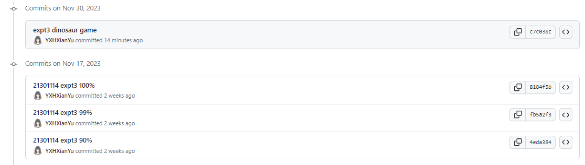

## 4. 其他说明

* 太酷了！
* 读懂代码的过程非常爽！
