# 操作系统 实验4

> 21301114 俞贤皓
>
> 环境（实验0~2, 4）：Arch Linux 6.5.3-arch1-1
>
> 环境（实验3, 4）：Ubuntu 22.04.3 LTS (WSL)

## 1. 实验步骤

### 1.0 备注

* 我在实验2中，使用了0.2.0-alpha.2版本的rustsbi-qemu完成了实验，所以之后的实验我也均用最新版的rustsbi-qemu完成。
  * 我会把我遇到与新版rustsbi-qemu有关的问题 **加粗**

### 1.1 实现应用程序

* 添加环境代码
  * 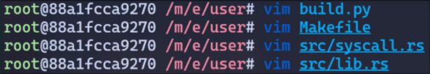
* 添加应用程序代码
  * 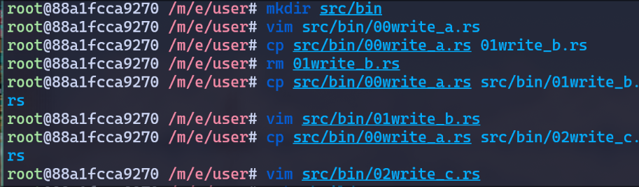
* 编译
  * 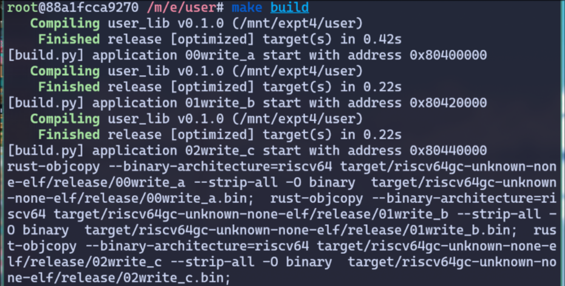
* 测试应用程序
  * 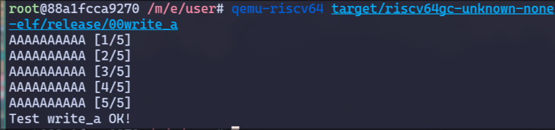

### 1.2 多道程序的加载

* 根据文档编写代码
  * 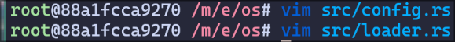

### 1.3 任务的设计与实现

* 根据文档编写代码
  * 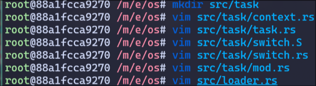

### 1.4 实现sys_yield与sys_exit的系统调用

* 根据文档编写代码
  * 

### 1.5 修改其他部分的代码

* 根据文档编写代码
  * 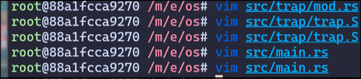

### 1.6 结果

* 成功！
  * 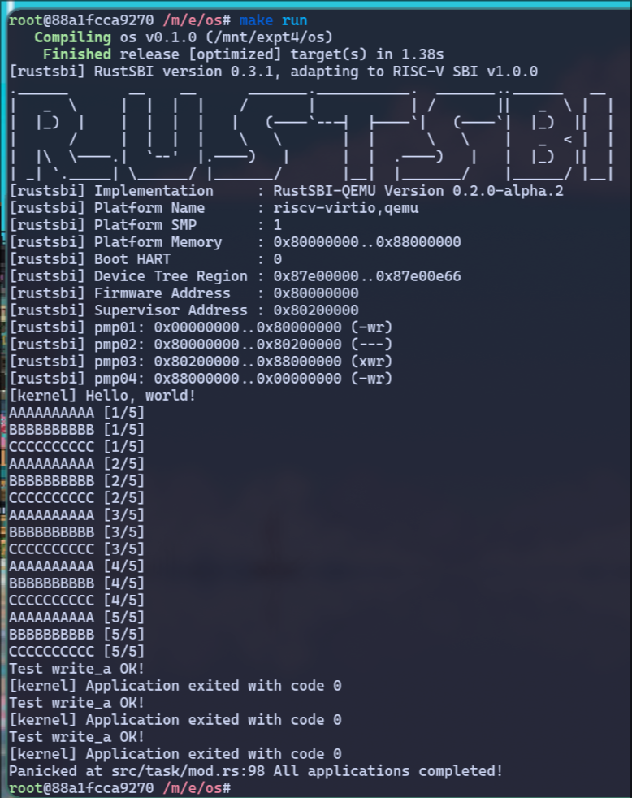

## 2. 思考问题

### 2.1 应用程序的加载

* 在多道程序中，我们要将应用程序同时加载至不同的内存片段，这样我们才可以同时在多个任务中进行切换，而不用反复加载应用程序，从而造成效率浪费
  * 与批处理不同，批处理每次只加载一个应用程序。当前程序执行完毕后，才将下个应用程序的二进制码加载到内存中的特定区域（0x80200000）

* `user/build.py`
  * 该脚本实现了多次cargo build特定应用程序，并且将每个程序的入口地址以 0x20000 为间隔设置
* `user/Makefile`
  * 该脚本与旧版的区别在于，该脚本调用了 `build.py` 进行编译
* `os/src/loader.rs`
  * 该代码实现了多道程序中的 内核态和用户态，并且实现了加载应用程序相关的代码
  * `load_apps()`：该函数是加载应用程序的核心。根据代码可以得知，该函数首先获得了应用程序个数，然后遍历每个应用程序，并且先将目标内存清空（设置为全0），再将应用程序的二进制代码拷贝至目标内存中

### 2.2 多道程序的设计与实现

* 为了实现任务的切换，我们需要保存任务的上下文。所以多道程序的核心就是，实现任务上下文的切换。
  * 根据实验的文档，任务上下文切换与Trap上下文切换极其类似，区别在任务上下文切换不涉及特权级的切换。
* `os/src/task/context.rs`
  * 该代码对任务的上下文进行了定义，明确了任务上下文储存的内容
* `os/src/task/task.rs`
  * 该代码的 `TaskControlBlock` 定义了上下文切换所需的更多信息
* `os/src/task/switch.S`
  * 该汇编代码实现了任务切换（大概是通过储存代码运行的指针和切换当前cpu执行代码的指针来实现的）
* `os/src/task/mod.rs`
  * 该代码实现了一个 `TaskManager`，该类封装了各种对任务相关的操作，便于其他代码调用。

### 2.3 多道程序操作系统中任务如何实现，它与进程和线程有什么区别和联系

#### 2.3.1 任务是如何实现的

* 在多道程序操作系统中，任务是通过TaskControlBlock来表示，每个应用程序对应一个任务；任务的上下文由TaskContext来储存；而任务的状态由TaskStatus来表示；任务的切换通过switch.S中的代码来实现，切换时，保存了当前任务的上下文信息，并恢复下一个任务的上下文信息。
* 最后，我们使用TaskManager对所有功能进行整合和封装，并抛出对应接口，最终实现了任务模块。

#### 2.3.2 任务与线程和进程有什么区别和联系

* 这里的任务类似于一个简化的进程。
* 联系
  * 任务存在上下文，而进程也存在上下文。
  * 任务存在TableControlBlock，而进程也存在ProcessControlBlock。
  * 任务可以切换，而进程也可以切换。
* 区别
  * 任务只能主动通过yield来让出CPU，而进程既可以主动让出CPU，也可以由OS统一分配CPU资源。
  * 进程的PCB更为复杂，包含了其他很多信息，而任务的TCB就只包含上下文指针等简单的两个信息。
* 关于线程
  * 在大部分OS中，线程是一个进程中用于实现异步等技术的一个技术，与任务和进程不属于同一个类型。

## 3. Git提交截图

* [仓库链接](https://github.com/YXHXianYu/GardenerOS)
* 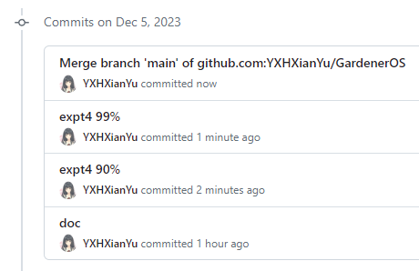

## 4. 其他说明

### 4.1 有关保留旧程序无法执行的问题

* 如果不删除旧的代码，直接进行编译，首先会产生一个数组越界错误。
  * 这个错误是由于 `config.rs` 中的 `MAX_APP_NUM` 为 $4$，所以产生了数组越界。
  * 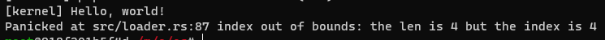
* 将 `MAX_APP_NUM` 调大之后，OS产生了死循环，卡死。
  * 这个错误是由于我们在异常处理中，将 `batch::run_next_app()` 注释掉，导致异常未被处理；
  * 同时， `00Helloworld.rs` 执行了一个非法指令 `asm!("sret")`，产生了 `IllegalInstruction` 异常；
  * 但是，异常处理不会运行下个app，而是重复执行当前app，所以就产生了死循环。
* 在异常处理中添加 `panic!("An exception occurs!")`，然后就可以解决这个问题，成功保留旧的应用程序！
  * 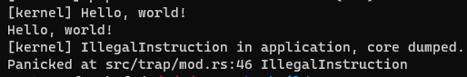
* 当然，`panic` 会导致OS直接崩溃，所以我们应该引入一个更好的方法 —— 直接停止当前应用程序并执行下个程序。
* 根据源码，我们可以找到函数 `task::exit_current_and_run_next()`，所以我们在异常处理中加入此函数。于是，我们就完美地解决了这个问题！
* 总的来说，只需要调大 `MAX_APP_NUM`，并且对异常进行处理，就可以兼容实验3中的应用程序。
* 代码文件
  * 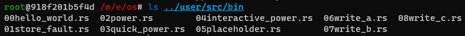
* 效果图
  * 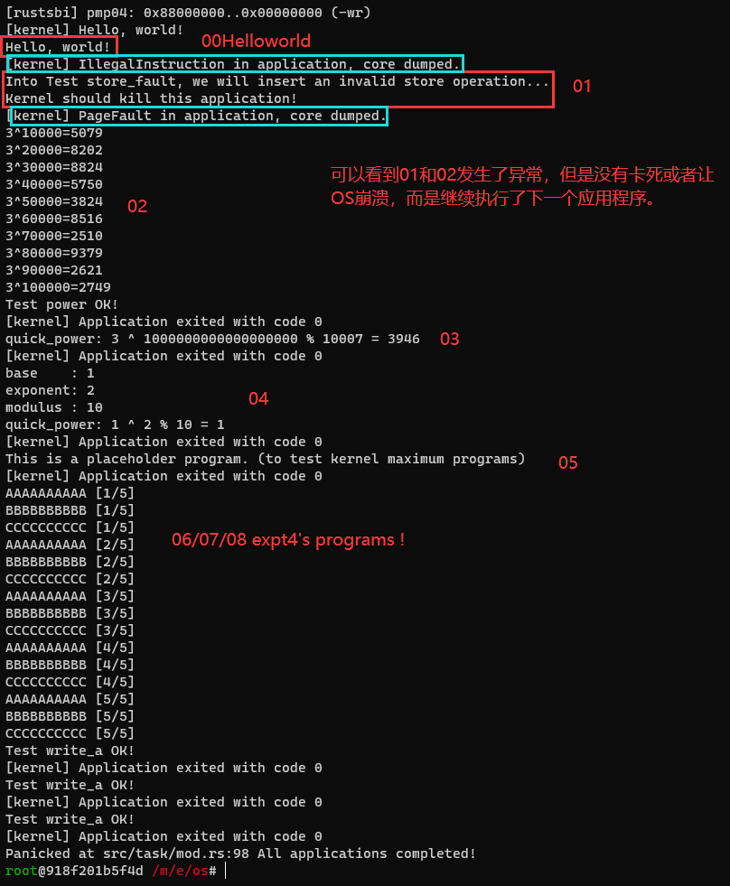
