# 操作系统 实验5

> 21301114 俞贤皓
>
> 环境（实验0~2, 4~5）：Arch Linux 6.5.3-arch1-1
>
> 环境（实验3~4）：Ubuntu 22.04.3 LTS (WSL)

## 1. 实验步骤

### 1.1 时钟中断与计时器

* 根据文档编写代码
  * 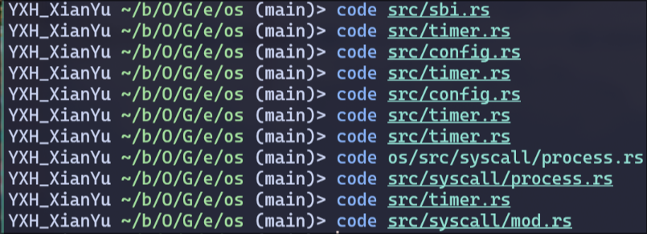

### 1.2 修改应用程序

* 根据文档编写代码
  * 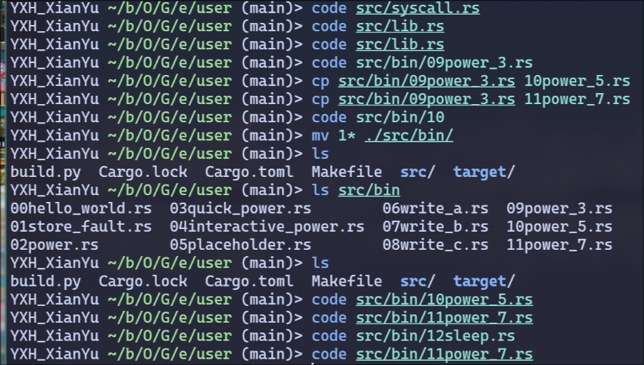
* 应用程序列表
  * 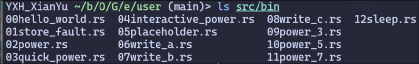

### 1.3 抢占式调度

* 根据文档编写代码
  * 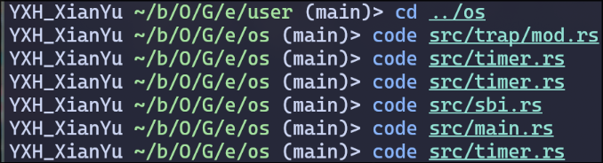

### 1.4 执行结果

* 编译应用程序
  * 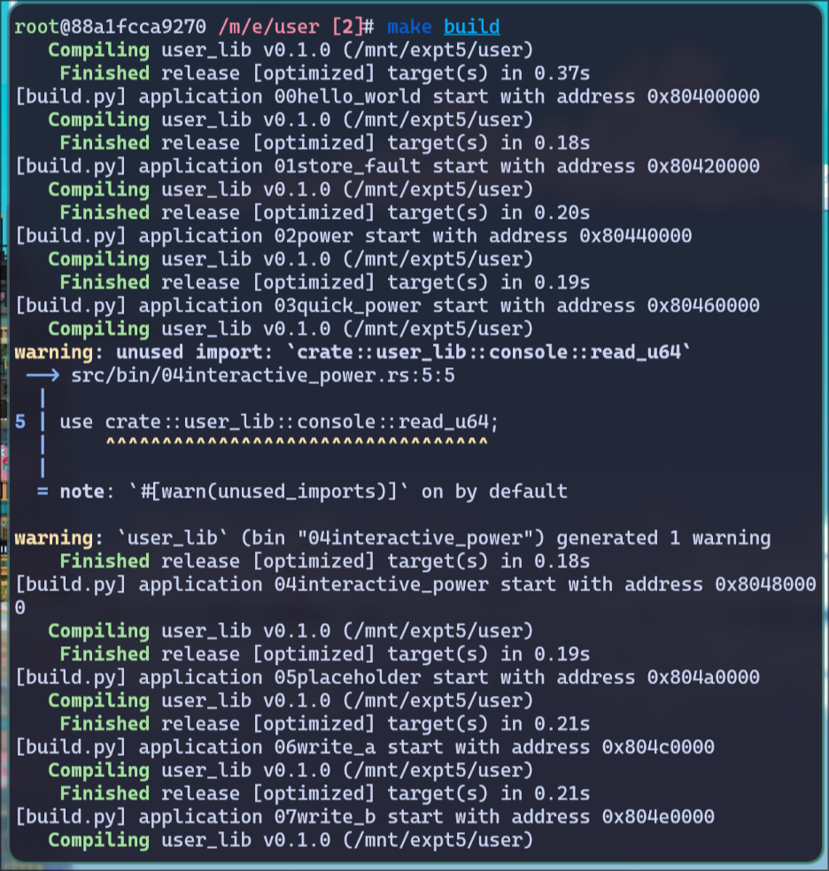
* 执行结果（分五页）
  * 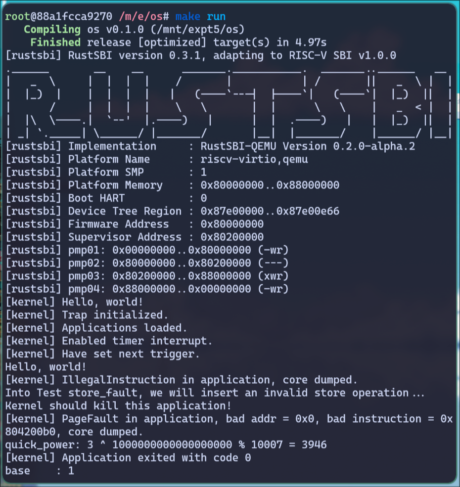
  * 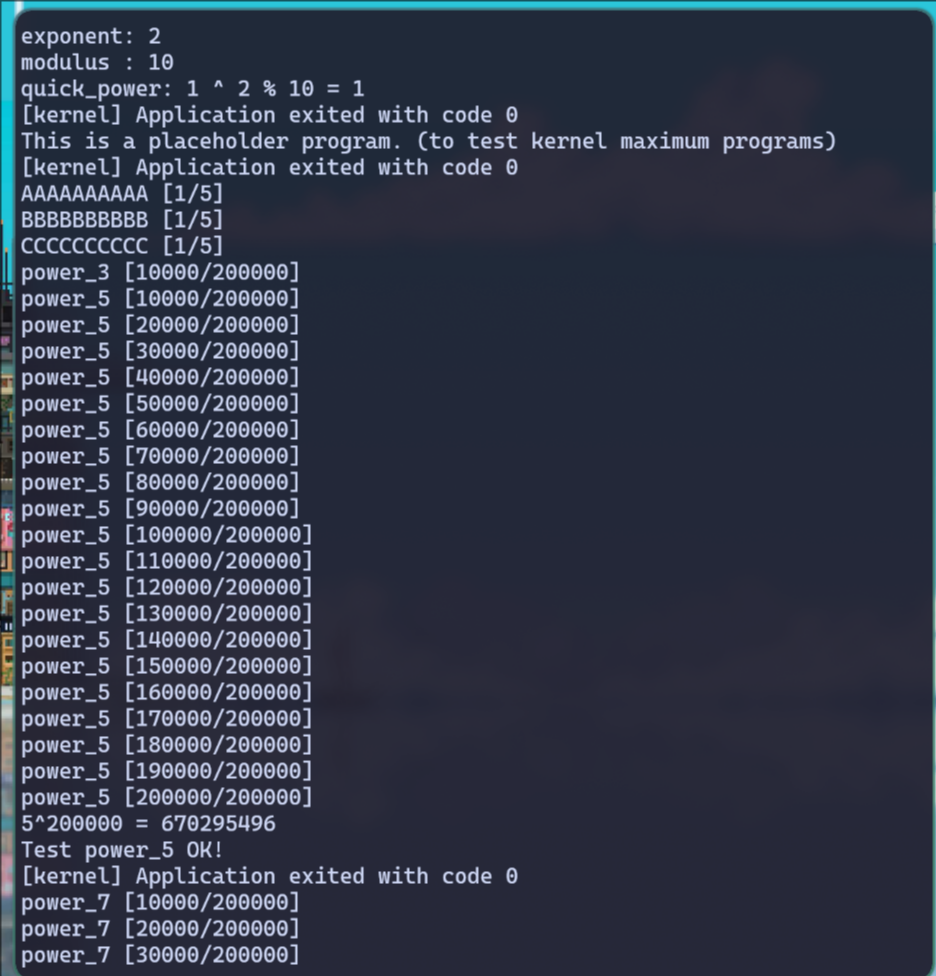
  * 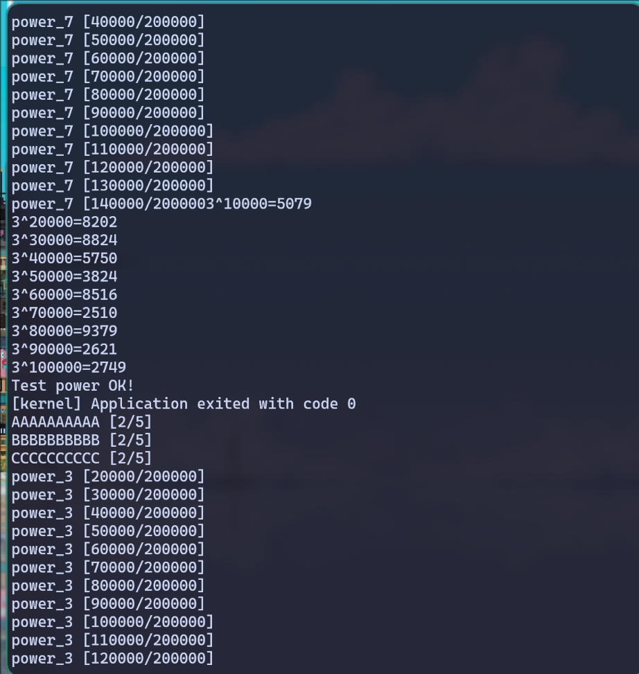
  * 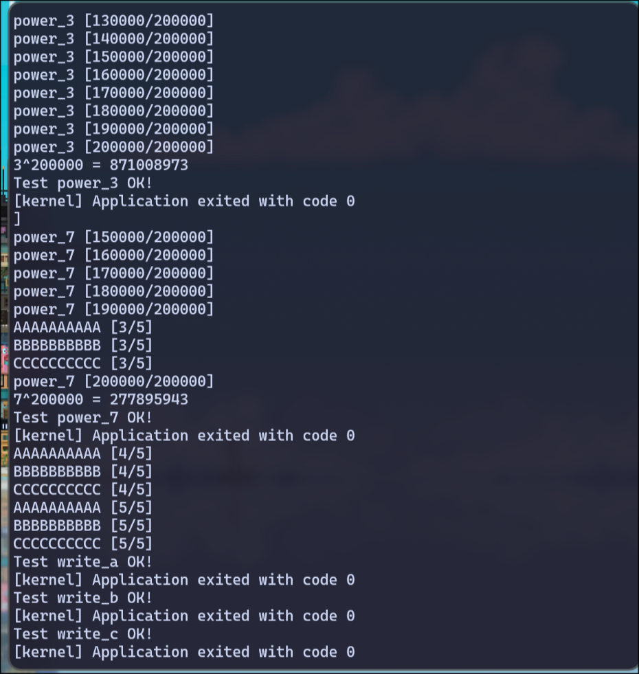
  * 
* 可以看到，执行结果乱序，比如power_3执行到[10000/200000]就切换为了power_5，power_5执行到一半又切换回了在实验3中实现的计算3次幂程序。这足以说明，除了主动让出进程所有权以外，操作系统在抢占式地，以分时的方式，给每个进程分配资源！
* 太酷了！

## 2. 思考问题

### 2.1 分析分时多任务是如何实现的

* 首先，我们需要在riscv架构中设置一个计时器，设置cpu执行多少秒后触发一次中断。
  * `os/src/timer.rs`
* 接着，我们需要使用riscv的sie::set_stimer()，来使得操作系统会定时对当前的进程产生一次中断。
  * `os/src/trap/mod.rs`
* 接着，我们要对中断异常进行处理。中断异常和其他异常有区别，不应该退出当前程序，所以我们 **不调用** `exit_current_and_run_next()`，而是调用 `suspend_current_and_run_next()`。
  * `os/src/trap/mod.rs`
* 最后，在操作系统入口处启用 `sie::set_stimer()` 的中断，并且设置第一次中断的时间间隔，然后就可以实现分时多任务。
  * `os/src/main.rs`

### 2.2 分析抢占式调度是如何设计和实现的

* 抢占式调度，我们沿用上次实验实现的任务上下文切换的机制，通过将当前任务的上下文储存起来，并读取下一个任务的上下文，来实现任务切换。而这个任务切换（挂起），是由操作系统发出的，并不是程序主动发出的，所以是抢占式调度。
* 核心函数为实验4实现的 `suspend_current_and_run_next()`，该函数分为两步
  * 第一步，挂起当前Task（将Task的状态设置为：Ready）
  * 第二步，执行下一个Task。
* 除此之外，我们是用定时器来定时中断当前任务，执行下一个任务。

### 2.3 对比协作式调度与抢占式调度

* 本操作系统中，协作式调度和抢占式调度的实现方法非常类似。
* 联系
  * 这两种调度方法均基于Task，中断或yield时，将当前Task的上下文进行储存，并切换至下一个Task。
* 区别
  * 协作式调度，为主动让出CPU资源，在代码中主动使用yield来触发。
  * 抢占式调度，为被动让出CPU资源，在操作系统中，通过计时器导致的中断来触发。
  * 抢占式调度，需要额外实现一个计时器。（也是本次实验的主要代码量）

## 3. Git提交截图

* [仓库链接](https://github.com/YXHXianYu/GardenerOS)
* 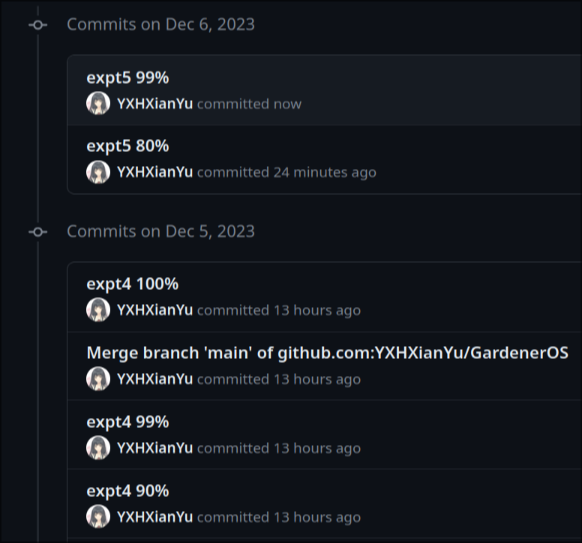

## 4. 其他说明

### 4.1 关于rustsbi-qemu新版的问题

* 我在实验2中，使用了0.2.0-alpha.2版本的rustsbi-qemu完成了实验，所以今天的实验我也均用最新版的rustsbi-qemu完成。

* 根据文档实现代码，并不做任何修改，在运行后，会产生 **卡死** 的现象。

  * 经过分析，代码在执行到 `task::run_first_task()` 语句时，程序卡死。

* 因为代码与文档一致，所以考虑rustsbi-qemu的问题。故查阅 [riscv-sbi文档](https://github.com/riscv-non-isa/riscv-sbi-doc/releases/download/v2.0-rc1/riscv-sbi.pdf)，发现旧的set_timer api已经被废弃。

  * 证据1：EID 0x00 已经被废弃，应该使用 0x54494D45
    * 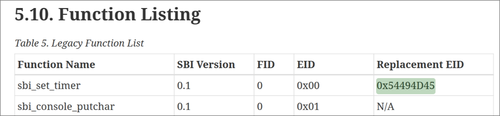
  * 证据2：专门介绍新API的文档
    * 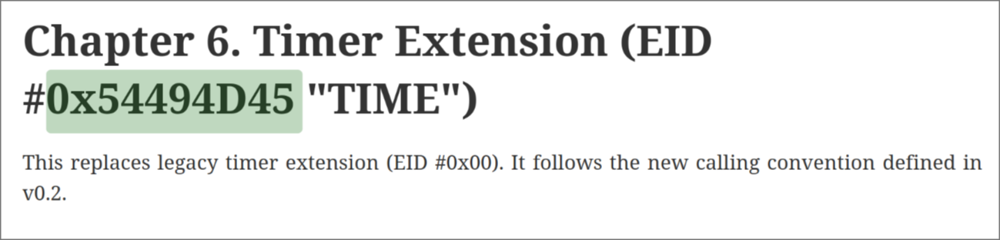

* 根据riscv-sbi文档对代码进行修改

  * 在 `os/src/sbi.rs` 中添加以下代码，并替换旧代码：

  * ```rust
    const SBI_EID_SET_TIMER: usize = 0x54494D45;
    
    #[inline(always)]
    fn sbi_call(eid: usize, fid: usize, arg0: usize, arg1: usize, arg2: usize) -> usize {
        let mut ret;
        unsafe {
            asm!("ecall",
                 in("x10") arg0,
                 in("x11") arg1,
                 in("x12") arg2,
                 in("x16") fid,
                 in("x17") eid,
                 lateout("x10") ret
            );
        }
        ret
    }
    
    pub fn set_timer(timer: usize) {
        sbi_call(SBI_EID_SET_TIMER, 0, timer, 0, 0);
    }
    ```

  * 请注意，**其他系统调用也要同步修改**。但我在实验2中已经修改了对应代码，这里就不深入描述。

* 于是，我们就得到了正确的输出结果～(∠・ω< )⌒☆

  * 如本实验手册1.4节所示。
