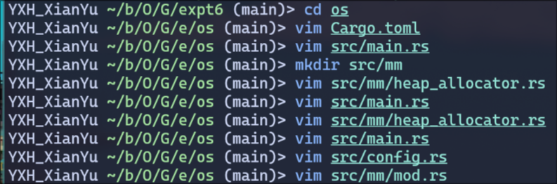
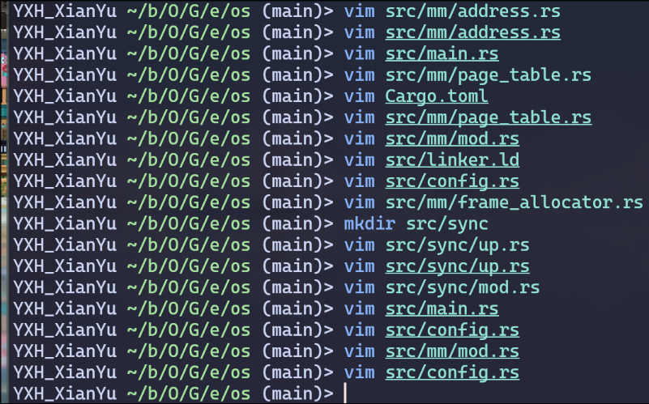
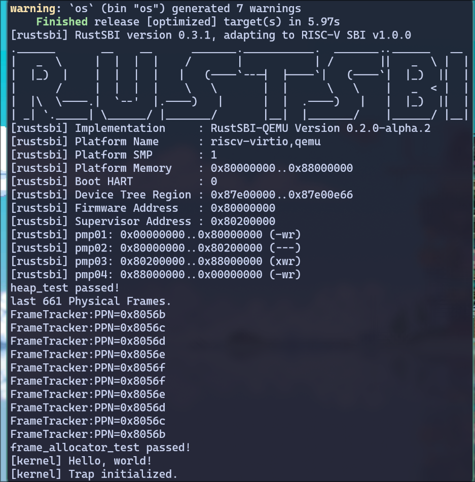
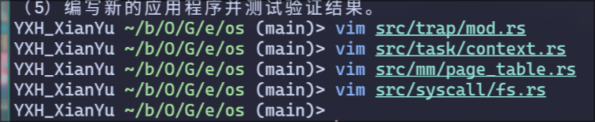
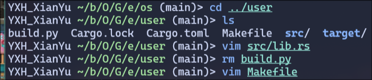
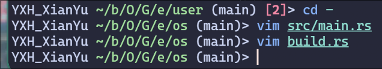

# 操作系统 实验6

> 21301114 俞贤皓
>
> 环境（实验0~2, 4~6）：Arch Linux 6.5.3-arch1-1
>
> 环境（实验3~4）：Ubuntu 22.04.3 LTS (WSL)

## 1. 实验步骤

### 1.1 在内核中支持动态分配内存

* 根据文档实现代码
  * 

### 1.2~1.4 地址数据结构、页表、物理帧

* 根据文档实现代码
  * 
* 执行 `make run`
  * 出现错误，如下图所示：
    * 
    * 查看 `main.rs: 21`，发现我在非函数中调用了一个普通函数，鉴定为python写多了，所以将 `mm:init();` 移至 `main` 函数中
  * 重新编译，成功
    * 

### 1.5~1.7 多级页表、地址空间、分时多任务

* 根据文档实现代码
  * 
  * 因为不小心把实验手册cat到终端里，导致历史信息翻不到，所以截图信息很少

### 1.8 修改应用程序

* 根据文档实现代码
  * 

### 1.9 修改main.rs

* 根据文档实现代码
  * 

### 1.10 执行！

* 遇到了很多错误，对其进行修复

## 2. 思考问题

## 3. Git提交截图

* [仓库链接](https://github.com/YXHXianYu/GardenerOS)
* 

## 4. 其他说明

* extern crate
* 