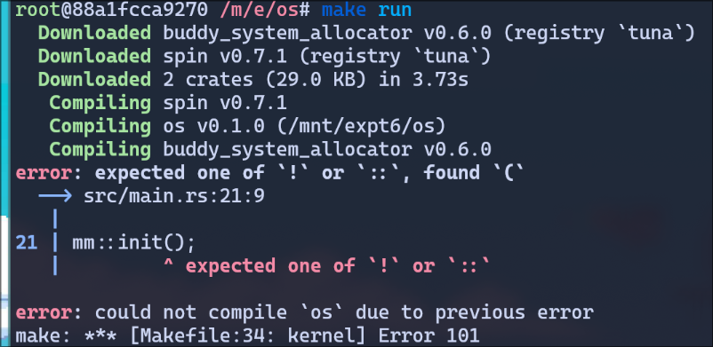
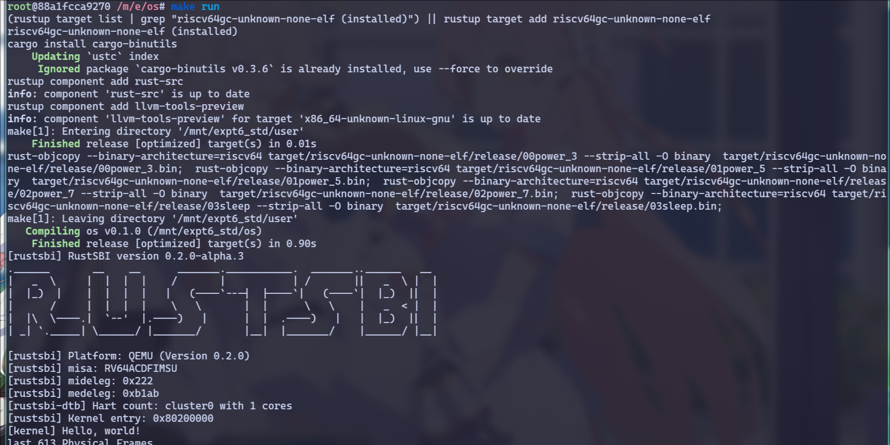
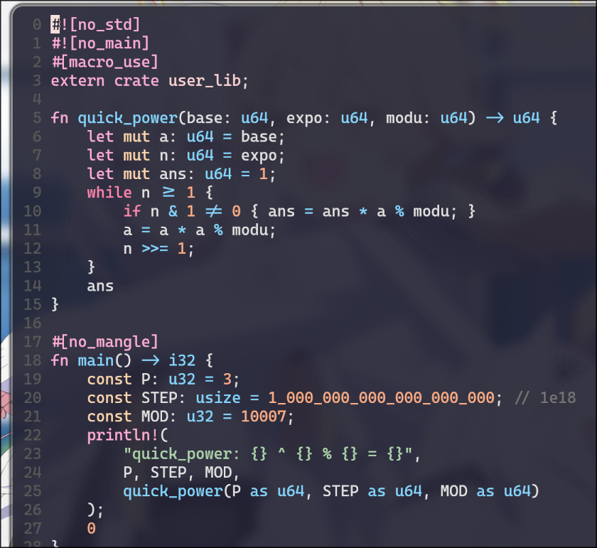
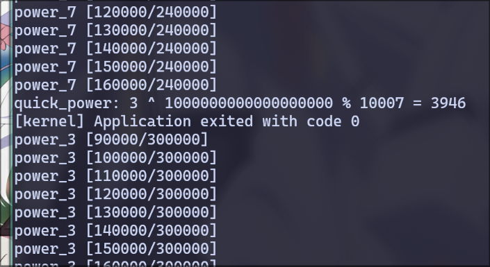

# 操作系统 实验6

> 21301114 俞贤皓
>
> 环境（实验0~2, 4~6）：Arch Linux 6.5.3-arch1-1
>
> 环境（实验3~4）：Ubuntu 22.04.3 LTS (WSL)

## 1. 实验步骤

### 1.1 在内核中支持动态分配内存

* 根据文档实现代码
  * 

### 1.2~1.4 地址数据结构、页表、物理帧

* 根据文档实现代码
  * 
* 执行 `make run`
  * 出现错误，如下图所示：
    * 
    * 查看 `main.rs: 21`，发现我在非函数中调用了一个普通函数，鉴定为python写多了，所以将 `mm:init();` 移至 `main` 函数中
  * 重新编译，成功
    * 

### 1.5~1.7 多级页表、地址空间、分时多任务

* 根据文档实现代码
  * 
  * 因为不小心把实验手册cat到终端里，导致历史信息翻不到，所以截图信息很少

### 1.8 修改应用程序

* 根据文档实现代码
  * 

### 1.9 修改main.rs

* 根据文档实现代码
  * 

### 1.10 执行！

* 遇到了很多错误，对其进行修复
* 修复完成后：
* 
* 
* 
* 

## 2. 思考问题

### 2.1 虚拟地址和物理地址的设计与实现

- 虚拟地址（`VirtAddr`）和物理地址（`PhysAddr`）通过Rust结构体定义，保证了内存管理的类型安全和清晰性。
- 引入虚拟页号（`VirtPageNum`）和物理页号（`PhysPageNum`），用于管理页式内存的基本单位，从而简化了地址转换和内存管理的复杂性。
- 实现了这些地址和页号类型与`usize`之间的相互转换。这种设计方法方便了虚拟地址和物理地址之间的转换，也便于与系统其他部分的交互。

### 2.2 物理帧的管理与分配

- `FrameTracker` 用于监控和管理单个物理页的使用情况，确保每个物理页的使用都被适当地追踪。
- 采用栈式结构来管理物理内存，提供了一种简单而有效的方式来分配和回收物理页。
- 空闲物理页存储在一个栈中，分配时从栈顶取出一个页号，回收时则将页号放回栈顶。这种方法减少了内存分配的开销，提高了内存分配的效率。

### 2.3 内核与应用程序的地址空间实现

- `MemorySet` 包含了内核的所有内存区域（如代码、数据和栈）。使用`MapArea`结构来表示特定的内存区域，通过页表条目的方式实现内存的映射。
- 在加载应用程序（基于ELF格式）时，根据程序头创建相应的内存映射。每个应用程序拥有独立的地址空间，实现了内存隔离和保护。
- 这种设计提高了系统的安全性和稳定性，防止了应用程序之间的相互干扰，确保了操作系统的稳定运行。

### 2.4 基于地址空间的分时多任务实现

- 使用`TaskControlBlock`和`TaskManager`来管理任务的生命周期，包括创建、运行、挂起和终止。
- 每个任务都有其独立的地址空间和上下文 `TrapContext`，使得任务切换时能够保留和恢复任务的状态。
- 利用satp寄存器在不同任务之间切换其地址空间，同时在用户态和内核态之间进行必要的上下文切换。
- 通过时间片轮转调度算法，实现了多任务的“同时”运行，从而提高了CPU的利用率和系统的整体响应性。

### 2.5 编写新的应用程序并测试验证结果

* 
* 我编写了一个快速幂程序
* 
* 快速幂程序第一个结束，执行时间最短。

## 3. Git提交截图

* [仓库链接](https://github.com/YXHXianYu/GardenerOS)
* 

## 4. 其他说明

* 无