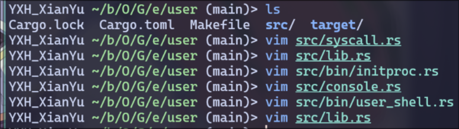
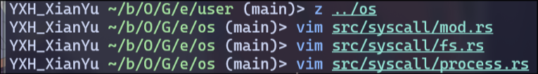
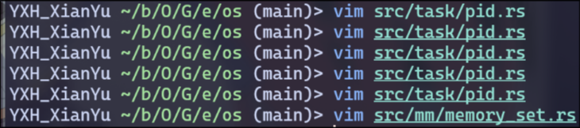
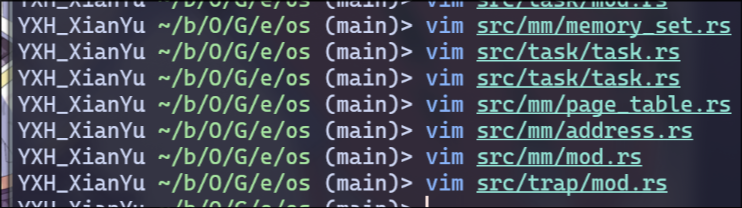
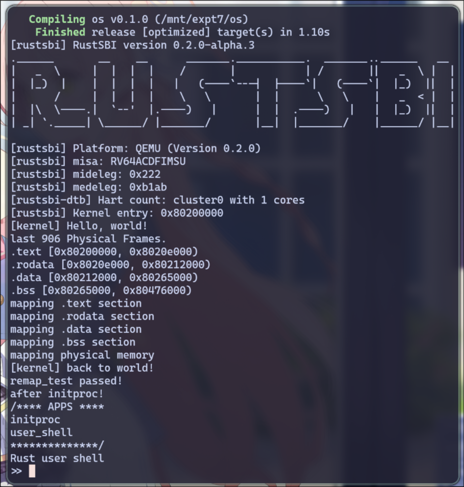
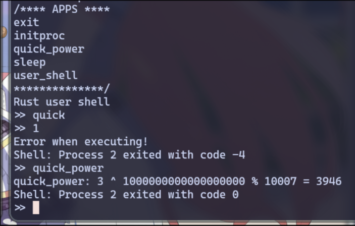
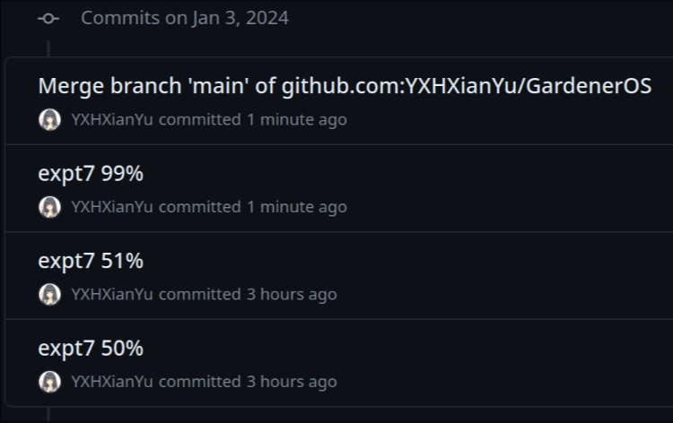

# 操作系统 实验7

> 21301114 俞贤皓
>
> 环境（实验0~2, 4~7）：Arch Linux 6.5.3-arch1-1
>
> 环境（实验3~4）：Ubuntu 22.04.3 LTS (WSL)

## 1. 实验步骤

### 1.1 修改应用程序

* 根据文档实现代码
  * 

### 1.2 在内核中增加系统调用

* 根据文档实现代码
  * 

### 1.3 应用的链接与加载

* 

### 1.4 进程标识符与内核栈

* 

### 1.5 修改实现进程控制块

* 

### 1.6 实现任务管理器

* 

### 1.7 增加处理器管理结构

* 

### 1.8 创建初始进程

* 

### 1.9 进程调度机制

* 

### 1.10 进程的生成机制

* 

### 1.11 进程资源回收机制

* 

### 1.12 执行

* 出现了比较多的问题，进行修改
* 最后，运行成功：
  * 
* 成功！但目前无法退出，尝试编写一些软件
* 添加了一些应用程序
  * 

## 2. 思考问题

### 2.1 应用的链接与加载实现

* 应用链接与加载是通过`os/build.rs`和`os/src/loader.rs`实现的
* 应用的名称和ELF格式数据被保存在全局向量`APP_NAMES`中
* 以便`exec`系统调用根据应用名加载对应的程序。这种机制允许根据程序名称动态地加载和执行不同的应用程序。

### 2.2 进程标识符与进程控制块设计实现

* 进程标识符（PID）通过`os/src/task/pid.rs`中的`PidAllocator`管理，保证每个进程有一个唯一的PID
* 进程控制块（PCB）在`os/src/task/task.rs`中定义，包含进程状态、内存空间、父子进程信息等
* 这种设计使得每个进程都有独立的运行环境和标识，便于管理和调度

### 2.3 任务管理实现

* 任务管理主要通过`os/src/task/manager.rs`实现
* 系统维护一个就绪队列，存储可运行的任务
* 通过简单的FIFO（先进先出）调度策略，从队列中取出任务并执行
* 这个机制简单高效，适用于多任务处理

### 2.4 进程调度、生成与资源回收实现

* 进程的调度、生成和资源回收分别在`os/src/task/mod.rs`和`os/src/task/processor.rs`中实现
* 进程调度通过切换任务上下文来执行不同的进程
* 进程生成主要通过`fork`和`exec`系统调用实现，其中`fork`用于创建新进程，`exec`用于加载和执行新程序
* 资源回收主要通过`exit`和`waitpid`系统调用实现，当进程结束或被终止时，系统会回收其占用的资源，如内存和文件描述符

## 3. Git提交截图

* [仓库链接](https://github.com/YXHXianYu/GardenerOS)
* 

## 4. 其他说明

* 无