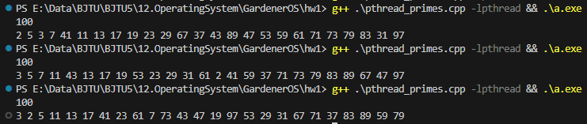
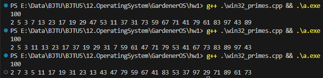
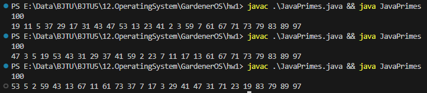

# OS Homework 1

> 21301114 俞贤皓

## 1. 作业内容

* Write a multithreaded Java, Pthreads, or Win32 program that outputs prime numbers.
* This program should work as follows: the user will run the program and will enter a number on the command line. The program will then create a separate thread that outputs all the prime numbers less than or equal to the number entered by the user.
* Submit: report (in word or pdf) and source code of your program.

## 2. 文件说明

* `README`
  * 实验报告与说明
* `pthread_primes.cpp`
  * pthread库的多线程求质数
* `win32_primes.cpp`
  * win32库的多线程求质数
* `java_primes.java`
  * java的多线程求质数

## 3. 实验内容

### 3.1 pthread

* 编译环境 `gcc 13.1.0 x86_64-win32-seh-rev1`

* 编译命令 `g++ .\pthread_primes.cpp -lpthread`

* 代码

  ```c++
  #include<bits/stdc++.h>
  #include<pthread.h>
  
  /* Common */
  bool check(int x) {
      for(int i = 2, lim = sqrt(x); i <= lim; i++) {
          if(x % i == 0) {
              return false;
          }
      }
      return true;
  }
  
  /* pthread */
  void* thread(void* ptr) {
      int x = *((int*)(ptr));
  
      if(check(x)) {
          printf("%d ", x);
      }
  
      pthread_exit(NULL);
      return NULL;
  }
  
  void solve_pthread(int n) {
      int* buf = (int*) malloc(sizeof(int) * (n + 1));
      pthread_t* id = (pthread_t*) malloc(sizeof(pthread_t) * (n + 1));
  
      // 1 is not prime
      for(int i = 2; i <= n; i++) {
          buf[i] = i;
          int ret = pthread_create(&(id[i]), NULL, thread, (void*)(&buf[i]));
          assert(ret == 0);
      }
      void* tmp;
      for(int i = 2; i <= n; i++) {
          pthread_join(id[i], &tmp);
      }
  
      free(buf);
      free(id);
  }
  
  /* main */
  int main() {
  
      int n;
      scanf("%d", &n);
  
      solve_pthread(n);
  
      return 0;
  }
  ```

* 执行结果

  * 

### 3.2 win32

* 编译环境 `gcc 13.1.0 x86_64-win32-seh-rev1`

* 编译命令 `g++ win32_primes.cpp`

* 代码

  ```c++
  #include<bits/stdc++.h>
  #include<windows.h>
  
  /* Common */
  bool check(int x) {
      for(int i = 2, lim = sqrt(x); i <= lim; i++) {
          if(x % i == 0) {
              return false;
          }
      }
      return true;
  }
  
  /* pthread */
  DWORD WINAPI thread(LPVOID lpParam) {
      int x = *((int*)(lpParam));
  
      if(check(x)) {
          printf("%d ", x);
      }
  
      return 0;
  }
  
  void solve_win32(int n) {
      int* buf = (int*) malloc(sizeof(int) * (n + 1));
      HANDLE* id = (HANDLE*) malloc(sizeof(HANDLE) * (n + 1));
  
      // 1 is not prime
      for(int i = 2; i <= n; i++) {
          buf[i] = i;
          id[i] = CreateThread(NULL, 0, thread, (LPVOID)(&buf[i]), 0, NULL);
      }
  
      for(int i = 2; i <= n; i++) {
          WaitForSingleObject(id[i], INFINITE);
          CloseHandle(id[i]);
      }
  
      free(buf);
      free(id);
  }
  
  /* main */
  int main() {
  
      int n;
      scanf("%d", &n);
  
      solve_win32(n);
  
      return 0;
  }
  ```

* 执行结果

  * 

### 3.3 Java

* 编译环境 `java 17.0.7 2023-04-18 LTS`

* 代码

  ```java
  import java.util.ArrayList;
  import java.util.List;
  import java.util.Scanner;
  
  public class JavaPrimes {
  
      private static boolean check(int x) {
          for(int i = 2, lim = (int) Math.sqrt((double)x); i <= lim; i++) {
              if(x % i == 0) {
                  return false;
              }
          }
          return true;
      }
  
      private static class MyThread extends Thread {
          int x;
  
          public MyThread(int x) {
              this.x = x;
          }
  
          public void run() {
              if(JavaPrimes.check(x)) {
                  System.out.print(x + " ");
              }
          }
      }
  
      public static void main(String[] args) {
  
          Scanner scanner = new Scanner(System.in);
  
          int n = scanner.nextInt();
  
          List<Thread> threads = new ArrayList<Thread>();
          
          for(int i = 2; i <= n; i++) {
              Thread thread = new MyThread(i);
              thread.start();
              threads.add(thread);
          }
  
          threads.forEach(thread -> {
              try {
                  thread.join();
              } catch (InterruptedException e) {
                  e.printStackTrace();
              }
          });
  
          scanner.close();
  
      }
  }
  ```

* 执行结果

  * 

