# 2022秋《操作系统》课程实验报告

> 实验1
>
> 21301114 俞贤皓

## 一、实验步骤

### 1. 准备实验基础平台

* 安装Docker
  * 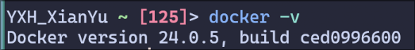

* 更换Docker镜像站
  * 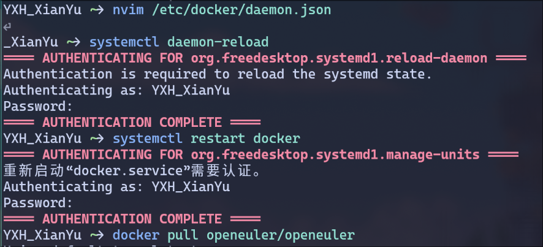

* 获取OpenEuler镜像
  * 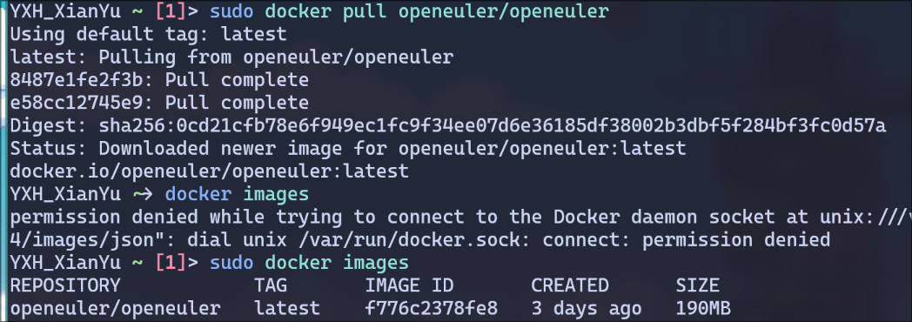

### 2. 创建本地开发目录

* 创建本地仓库并链接到github仓库
  * 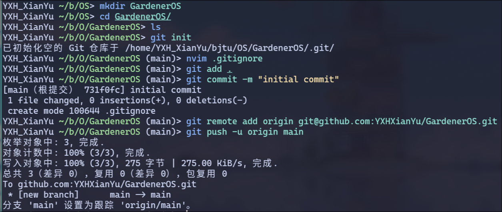

* Github结果
  * 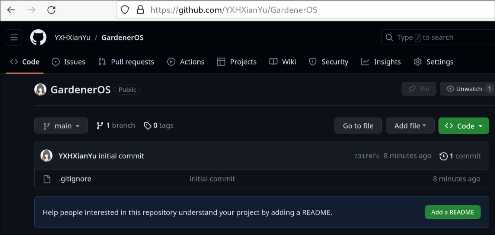

### 3. 创建自己的docker镜像

* 启动容器
  * 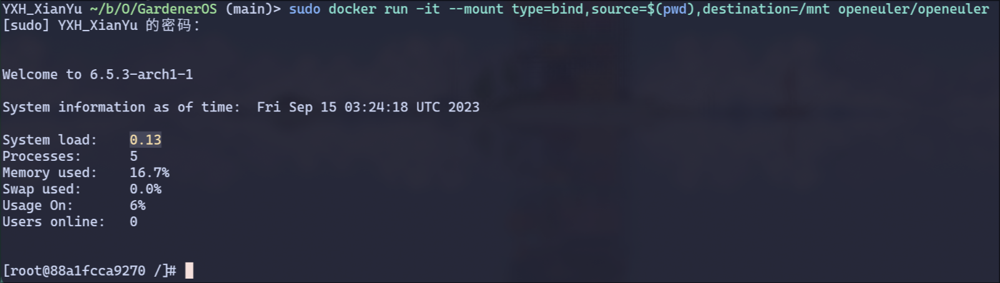
* 修改容器名称
  * 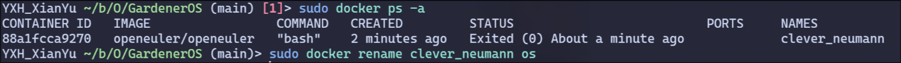
* 安装一些必要的工具
  * 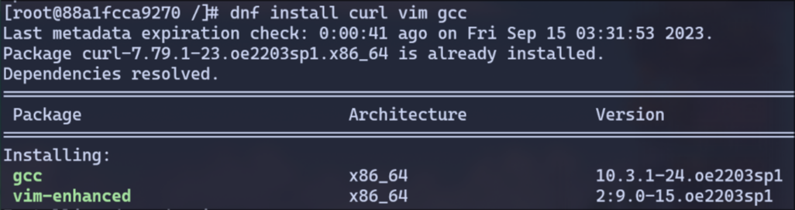
* 安装fish shell和配置
  * 尝试将docker的默认终端修改为fish
  * 但是发现attach docker时，实际上并不是使用docker内的shell，而是使用主机上的shell
  * 上网搜索后，发现需要使用DockerFile重新建立镜像
  * 过于麻烦，所以我直接写了一个 `startDocker.fish` 脚本，自动重启docker，并且以fish shell进入docker
  * 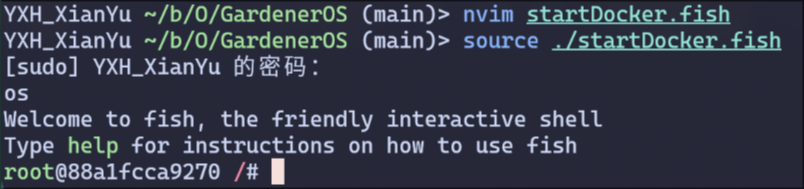
* 导入vim配置
  * 装一下git，配置一下ssh，然后直接clone我的配置仓库，配置一下就可以了`git@github.com:YXHXianYu/YXHXianYu-vim.git`

### 4. 配置Rust开发环境

* 添加环境变量
  * 因为我用的是fish shell，所以我修改 `~/.config/fish/config.fish`
  * 然后发现docker还是蛮智能的，使用外部的shell进入，会自动调用对应shell的配置文件
  * 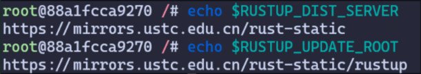
* 安装rust
  * 遇到了 `curl(6): Curl could not resolve host` 的问题，搜索后发现需要修改 Docker 的 DNS
  * 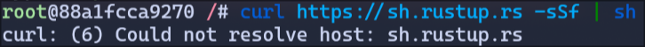
  * 修改后就正常运行了
  * 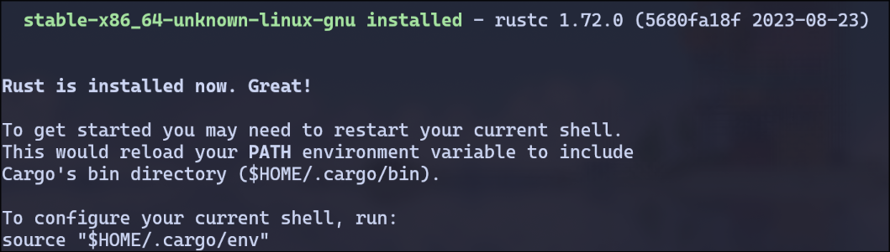
* 将rust bin目录添加进环境变量
  * 因为fish执行不了bash的脚本，所以需要自己整一下，整完就好了
  * 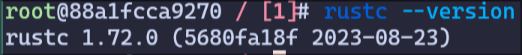
* 将rust版本改为nightly
  * 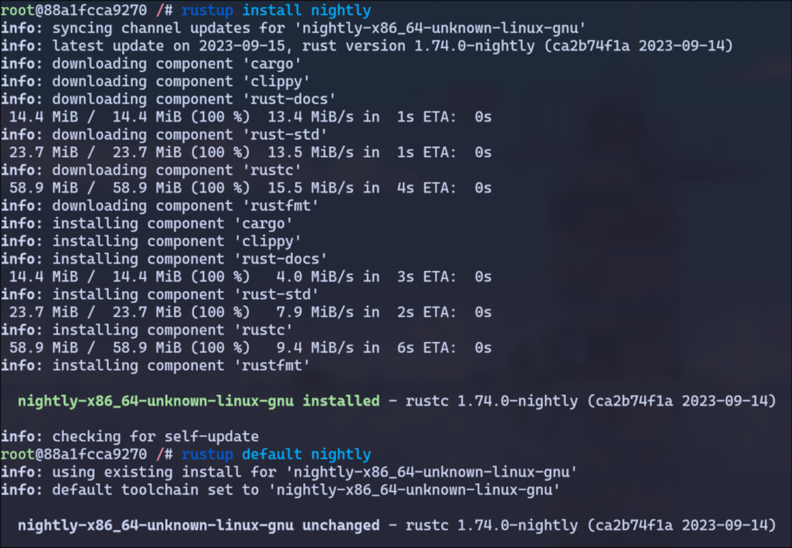
* 切换cargo软件包镜像为tuna
  * 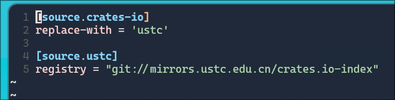
* 安装一些Rust相关的软件包
  * 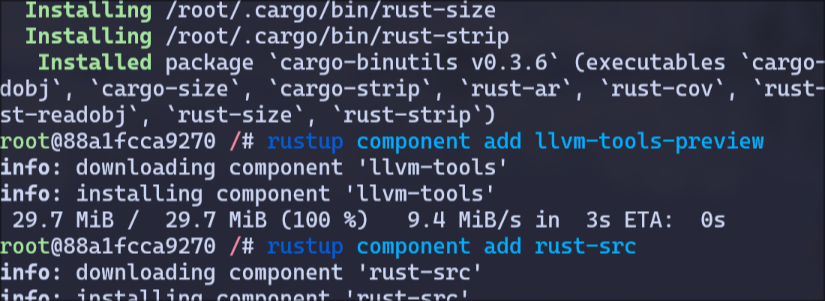

* 限制rust的版本
  * 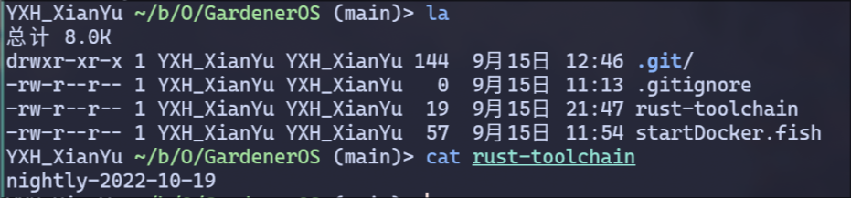

### 5. 安装qemu

* 安装rpm-build
  * 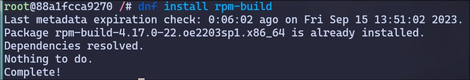
* 安装 Development Tools
  * 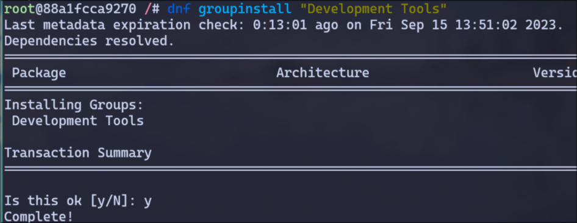
* 安装glib2
  * 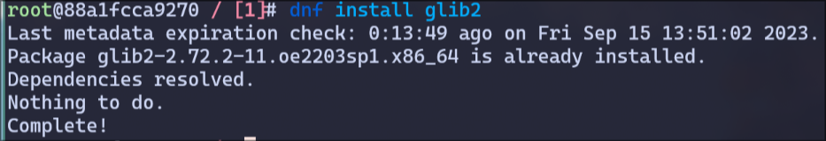
* 安装glib2-devel
  * 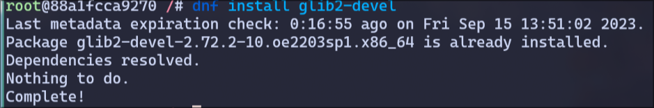
* 安装一系列包
  * 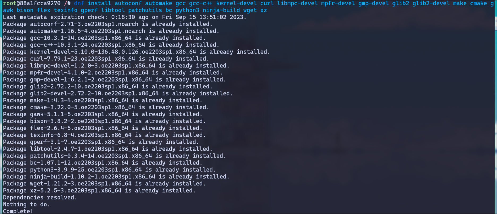
* 通过源码安装qemu 5.2
  * 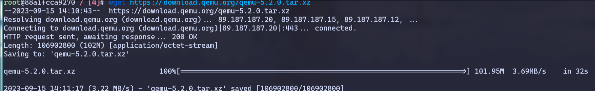
* 解压、构建、验证
  * 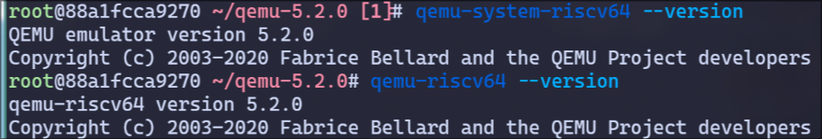
* 导出成新的镜像
  * 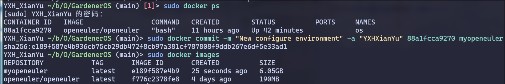

## 二、思考问题

* 无

## 三、Git提交截图

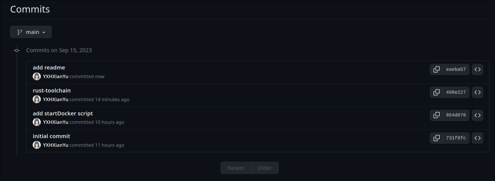

## 四、其他说明

这个实验太棒了，学到了很多东西，非常喜欢！

之前经常听说docker，但从来没用过，今天第一次接触docker，被docker的强大震撼到了。在一台电脑上配好环境，只需要把镜像传到另一个电脑上，另一台电脑的docker就可以提供一个环境直接运行镜像！相当于一个轻量化的虚拟机。

那docker+git+github这个工作流就很高效，我平常在宿舍用台式机，在教室用笔记本。原本还在想着，台式机环境懒得配了，以后os作业都在笔记本上写。而docker正好解决了我的这个问题 OvO
